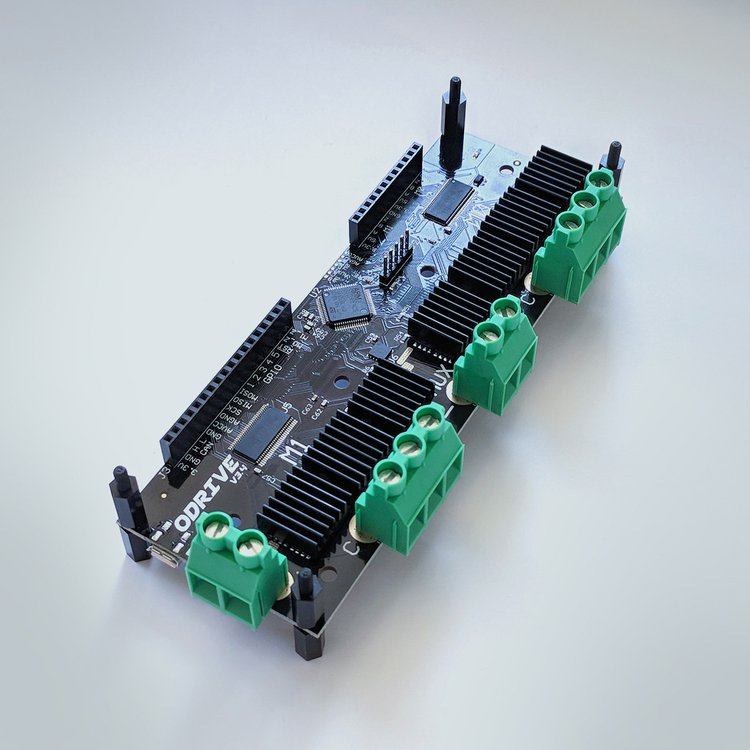
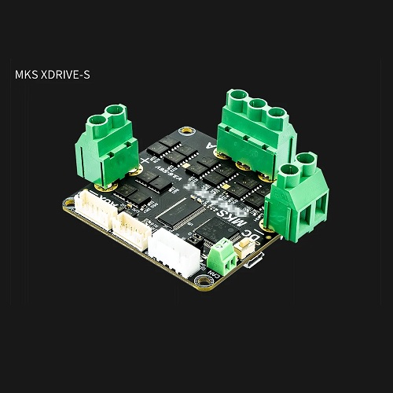
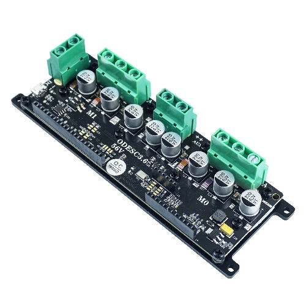
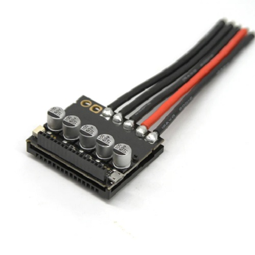
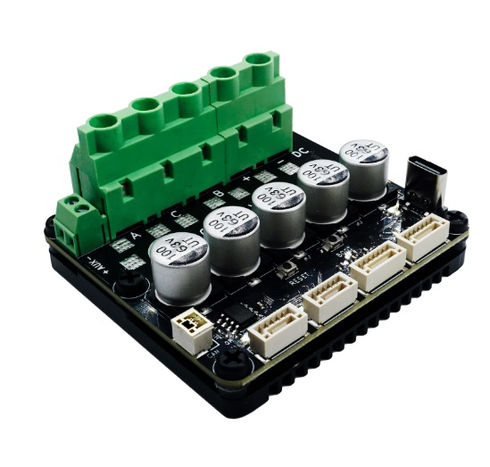

- TOC
{:toc}

---

## Supported controller types

For now, the FFBeast firmware is compatible with controllers that work with ODrive 3.6, including various remixes such as ODESC and XDrive.
All this controllers are based on schematic for [**ODrive project**](https://github.com/odriverobotics/ODriveHardware) with some slight changes and/or improvements. 
Even so them could look completely different them share common component base and schematic. 
{: .important }

## Confirmed compatibility
The controllers from the list have been tested, and compatibility with FFBeast firmware is confirmed.

### [Original ODrive 3.6](https://odriverobotics.com/shop/odrive-v36)

This is a two-axis PCB featuring high-quality onboard components, with support and warranty provided by the board developer. 
If you require an authentic board and wish to support the project's author, simply purchase the board from the [**official ODrive store**](https://odriverobotics.com/shop/odrive-v36).

### Makerbase XDrive Dual Axis

This is a remix of a well-known schematic with the addition of ESD protection on the USB line, 
offering an affordable and reliable alternative available from a trusted Chinese store.

### Makerbase XDrive Single Axis

This is a modified version of a well-known schematic designed for single motor use. 
If you only require one axis and prefer not to pay extra for an unused second axis, 
this provides a cost-effective alternative available from a reputable Chinese store.

### ODESC 3.6

This is a remixed version of a well-known schematic, 
produced by trusted RC components manufacturers such as Flipsky and SEQURE.
It features a slightly different alignment and includes a full-body heat sink for effective heat dissipation.

### Single axis ODESC 3.6/4.0

This is a modified version of a well-known schematic designed for single-motor use. 
If you only need one axis and wish to avoid paying extra for an unused second axis,
this option is not only cost-effective but also very compact, featuring a full-body heat sink.

### Single axis ODESC 4.2

This is a modified version of a well-known schematic designed for single-motor use.
If you only need one axis and wish to avoid paying extra for an unused second axis,
this option is not only cost-effective but also very compact, featuring a full-body heat sink.

## NoName ODrive 3.6 clones
I won't be sharing direct links here, but I believe we're all familiar with the 
platform where such items are commonly found (Hello A...s.com). If you're on a tight budget and 
willing to take the risk of potentially faulty components, 
feel free to explore and purchase any clone you can find.

## Which is the best?

**There isn't a single winner among them. You can pick any board from the options mentioned below based on what's 
easier for you to obtain. Just make your choice and proceed with the purchase!**  