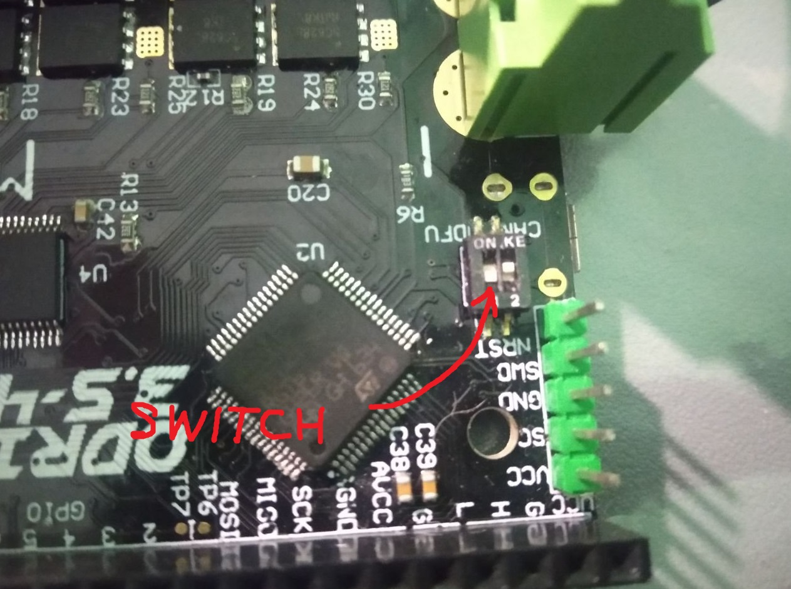
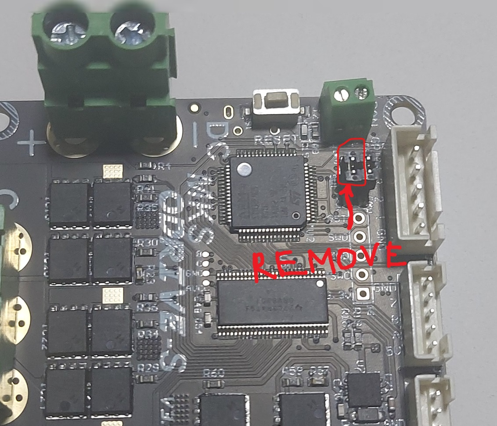
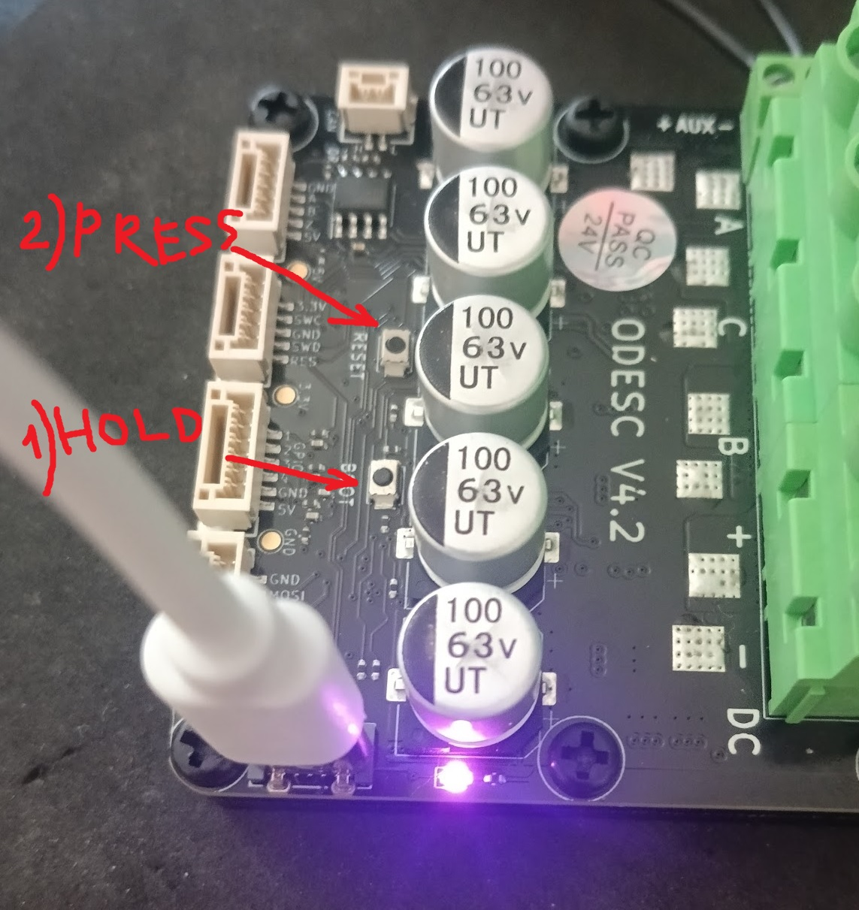

- TOC
{:toc}

---
## STM32CubeProgrammer 
To flash FFBeast firmware to controller you need to use 
[**STM32CubeProgrammer**](https://www.st.com/en/development-tools/stm32cubeprog.html#get-software). 
It is specialized util for flashing STM32 controllers.
Just download it from official site and install.

## External power

{: .important }
> ODrive boards do not power up from USB! 
> Solution?
>**Connect external power source to boot the controller!**

## DFU
All STM32 controllers support firmware flashing in DFU(Device Firmware Upgrade) mode directly via USB cable. 
Most boards have physical switch that allow to enable boot in DFU state. Here are some examples.

### ODrive

Usually it have micro switch. So process of booting in DFU mode will be following:

- Disconnect external power from the board.
- Switch micro switch to DFU position.
- Connect external power - controller will boot in DFU mode.

### MKS XDrive

This boards have jumper on it. So process of booting in DFU mode will be following:

- Disconnect external power from the board.
- Remove DFU jumper.
- Connect external power - controller will boot in DFU mode.
- 
### ODESC 4.2

This boards do not have dedicated switch or jumper but have special button:

- Connect external power. Controller will boot in normal mode.
- Press and hold **BOOT** button.
- Press **RESET** button - controller will reboot in DFU mode.

{: .important }
> Unfortunately not all boards available on market have physical DFU mode switch. In case it is missing on your board 
> you will need to use ST-LINK to flash firmware to the controller

## ST-LINK
This procedure requires an STLink/V2 or compatible programmer.

## Flashing process