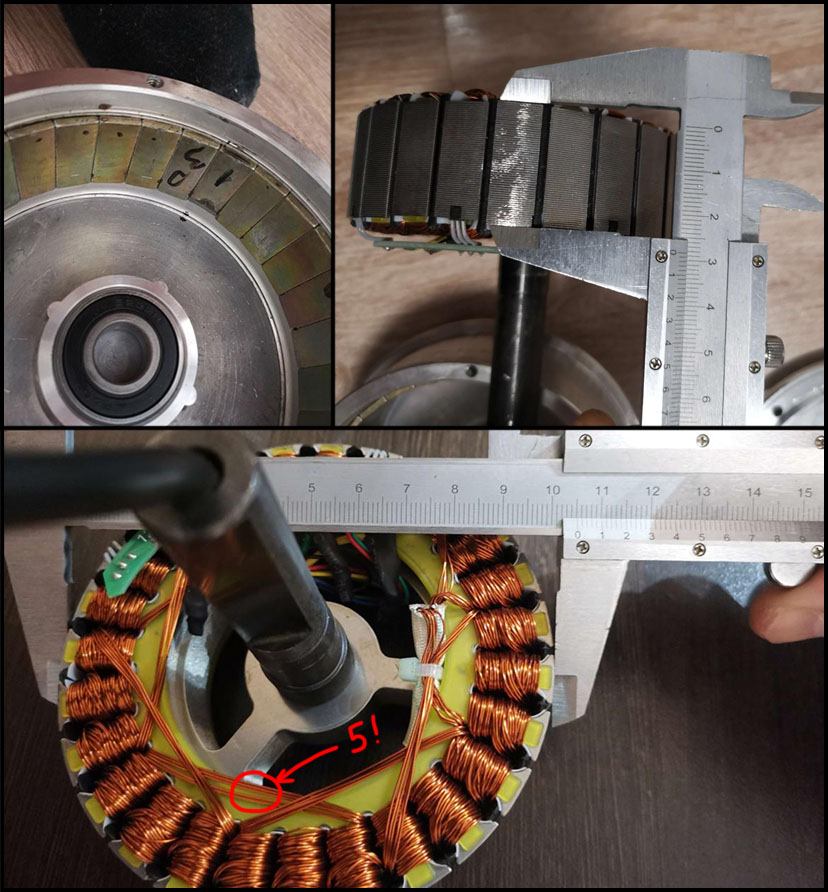
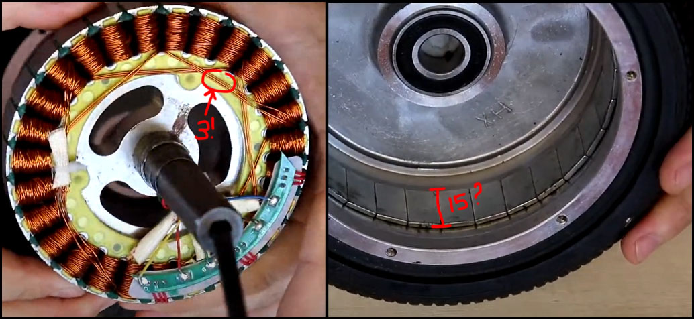
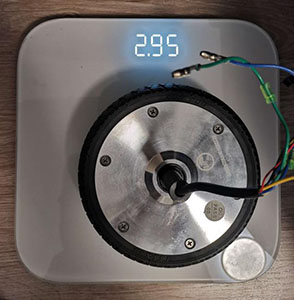

- TOC
{:toc}

---

## Supported motor types

FFBeast project based on **BLDC (BRUSHLESS) motor**. None of other types is supported. **There is no DC or Step motor support!** 

Virtually any BLDC motor with three phases will work, ranging from hobby-grade to industrial.
The performance of the final device will be determined by the characteristics of the motor you choose. A motor capable of producing more torque will result in a stronger final device.  

## Howerboard/Scooter motor

As of now, the hoverboard/scooter motor is considered **the best alternative** in terms of the **price-to-torque ratio**.
It can be as affordable as **10 USD** per item on the second-hand market, offering a peak torque of **up to 15Nm**. 
You can find them as standalone units or as part of refurbished hoverboards. 

Simply search your local second-hand market, and you're likely to come across some excellent propositions.

### Are them all equal?
Unfortunately - no!

Despite the similar external dimensions of these motors, they can vary internally. The motor's power is determined 
by the width of the stator, the diameter of the stator, and the number of strands in the motor winding

The most powerful items have stator width 30mm and 300mm magnets. It is coupled with 5 strand in motor winding.

Less powerful items could have 25mm, 20mm or even 15mm stator width and less strands in winding wire.

{: .important }
> It is important to understand, that any such motor will work, despite of internals.
> The main difference will be in peak motor torque (and so peak force that device can produce)

### How to choose good one?
Unfortunately, there is no absolutely reliable way to determine the internal components of a motor 
without disassembling it. Motors with the same pattern on the front 
may have different internal structures, 
while motors with completely different external appearances could be similar inside.

The only approximate method to guess motor internals - is .... the motor weight!

Because more powerful motors have more metal inside their weight should be higher
Internals and power guess by weigh:
- 30mm magnets/stator - 2.9 kg
- 25mm magnets/stator - 2.6 kg
