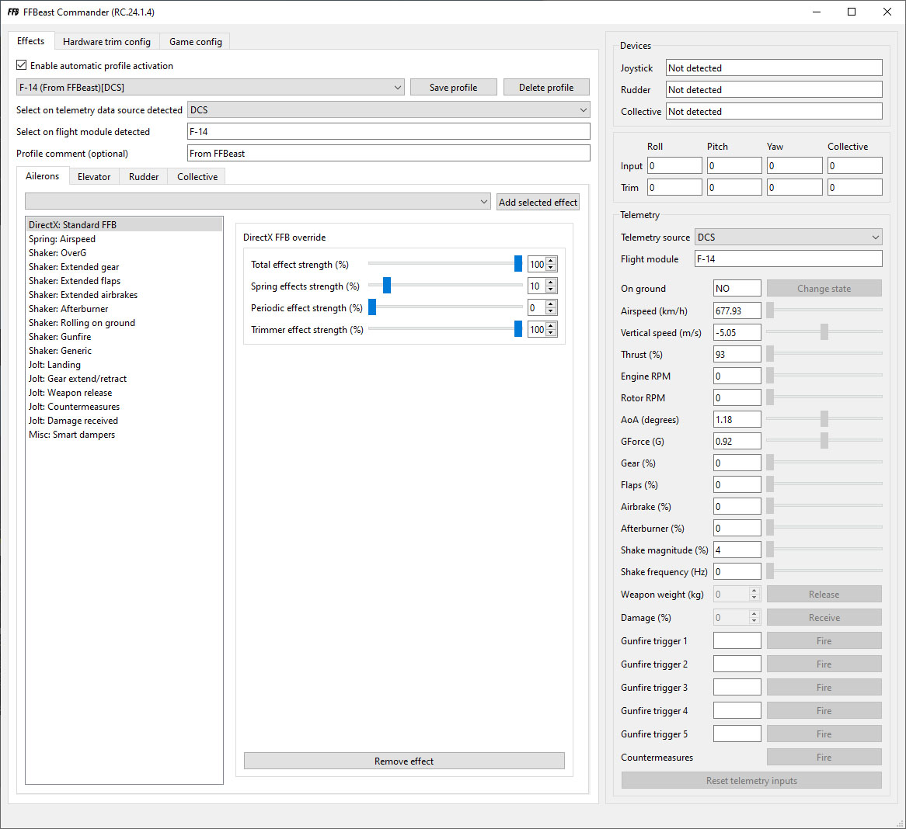

It serves as the core and heart of the entire FFBeast flight controls ecosystem.
Its purpose is to bring devices to life by gathering telemetry from games, generating a variety of effects,
and playing them on connected devices. The user interface is intuitively divided into separate sections,
each of which is covered in detail on its dedicated page. 