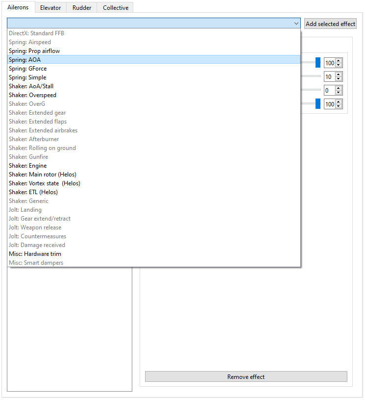
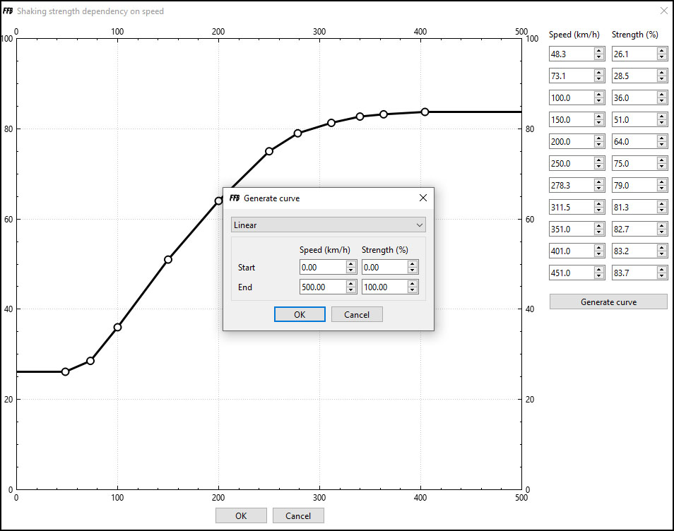
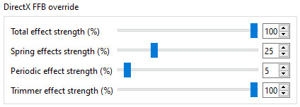
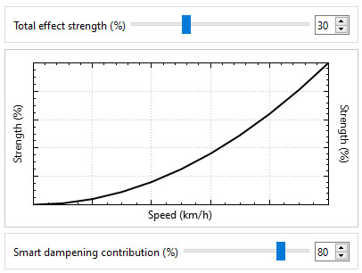
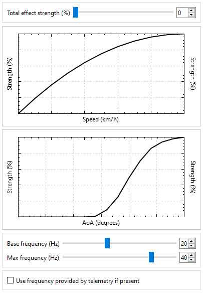
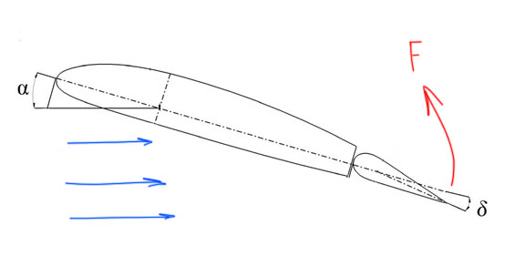
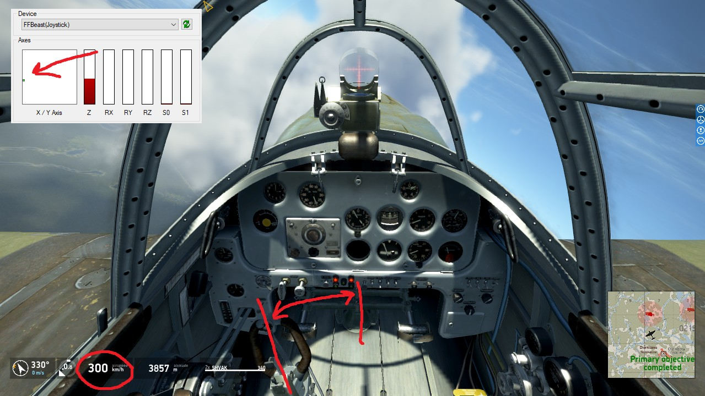
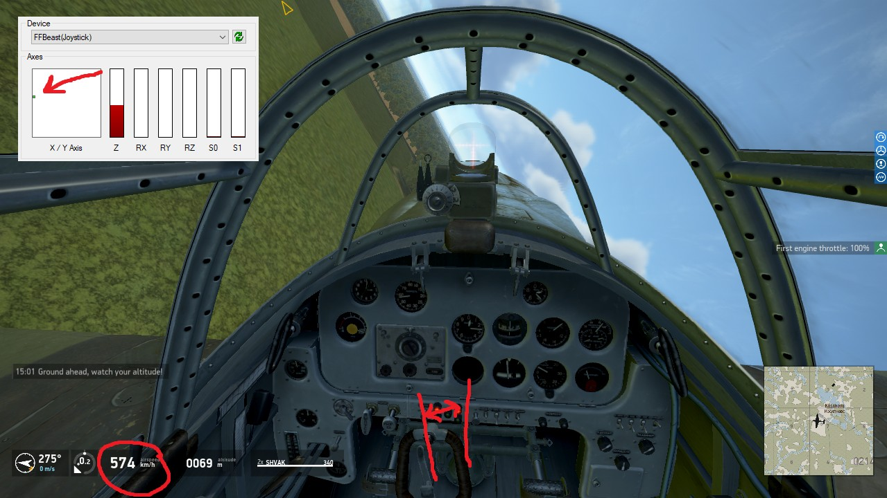
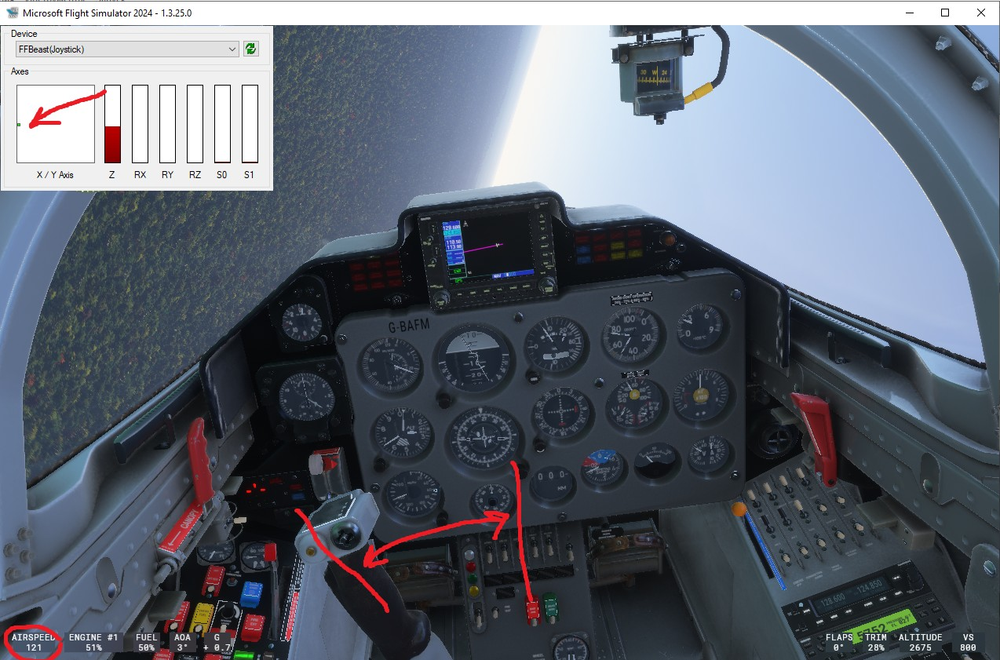
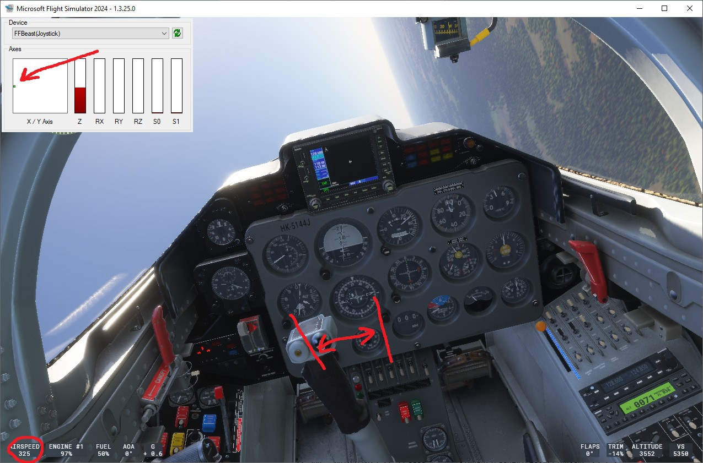

- TOC
{:toc}

---

This section UI is responsible for setting up and tuning effects.

# Common concepts

## Effects dropdown

Contains all effects that is possible to use in specific combination of game and axis:
some effects are not supported by specific games (for example gunfire is obviously not present in MSFS), 
and some effects are not relevant for specific axes (as an example Elevator weight can not be applied to Ailerons).

## Active effects list

Only effects present in the list on the left side of the UI are active!
If effect is not present in the list it is not used in calculations. 
- **To activate** the effect select it in dropdown and press **Add selected effect** button. 
- **To deactivate** the effect select it in active effects list and press **Remove effect** button. 

## Total effect strength

All effects have this parameter. It controls influence of the effect on final calculated force.
This parameter will scale all parameters of specific effect related to strength. Additional strength sliders and 
strength curves will be scaled by it.

{: .important }
> **Rule of thumb for parameter value**
> - **Spring effects** -  try to keep the value at 100. It will allow to set curves in spring effects to realistic values in Kg 
> and not to make calculations in mind in order to estimate how strong will be a spring. 
> - **Periodic effects with curves** - try to keep the value around 50 and adjust curves. 
> It will give enough compliance to change strength of periodic effect during tuning shakers for specific device. 
> - **Periodic effects without curves** - set it to the level needed for adequate shaking strength. 
>
> Check template profiles as example of this approach. Even so it is not mandatory to apply this principle everywhere, 
> it is highly recommended, especially for profiles that meant to be shared with others.    

## Curve editor
Most of effects have one or two parameters driven by curve, and curve editor will be the
most used instrument for such value tuning.

Get familiar with it:

- **Curve points** can be moved by mouse.
- **Mouse middle click** zoom in and out curve view if curve do not fill the whole range of the graph.
- **Spinboxes** can be used for precise point coordinate manipulation.
- **Generate curve** instrument provides possibility to generate common curves quickly. Start and end of the curve can be any point inside the graph range.

## Trim

FFBeast Commander uses combined trim effect. It uses sum of trimmer value from [**DirectX FFB**](ffbeast_commander_effects.html#standard-ffb) and [**Hardware Trim**](ffbeast_commander_effects.html#hardware-trim).  

# Effects

## DirectX 

### Standard FFB
Controls power of DirectX effects. Final effect strength is result of multiplying value from commander and corresponding value from [**FFBeast Setup**](ffbeast_setup_effects.html#directx)

{: .highlight-title }
> **Example**
> - Periodic effect strength in FFBeast Commander is set to 75%
> - Periodic effect strength in FFBeast Setup is set to 50%
> - Resulting effect strength will be equal to 75% * 50% -> 37.5%

## Springs

Spring effects are types of effects representing centering forces.
Strength of centering force depends on different flight data according to the type of effect.
All springs have a curve representing level of influence.

**Common effect parameters:**
- **Total effect strength** as [**described above.**](ffbeast_commander_effects.html#total-effect-strength)
- **Strength curve** - stores dependency of spring strength on parameter specific to effect type. 
- **Smart dampening contribution** - how much spring strength affects dampening level. Check [**Smart dampers**](ffbeast_commander_effects.html#smart-dampers) effect for more details.
In most cases it can be set to 100. Only need to be lower if you want to decrease proportion in which specific spring force affects total dynamic dampening.

{: .important }
> If all spring effects have **Smart dampening contribution** set to 0 no [**Dynamic Dampening**](ffbeast_commander_effects.html#smart-dampers) effect will be present.

{: .important }
> All spring effects have center position affected by [**Trim**](ffbeast_commander_effects.html#trim)

{: .note }
> **Tip on creative use...** 
> 
> Turn on your imagination! Variety of spring effects gives freedom in effect setup. Even so some combination of 
> them will produce not IRL response - it can give an information which will help you to feel airplane better. 
> We do not have feeling of all forces airplane can produce during a flight. 
> So why not to add this information through the stick?

### Airspeed spring

Type of spring which reacts on changing airspeed.

Pretty much all non FBW airplanes should have this effect as the main source of force as it represents 
the most natural air dynamic force. Usually it should be a parabola starting at zero speed. 

### Prop airflow spring

Type of spring which reacts on changing thrust.

Usually it should be present on elevator and rudder axis of prop driven airplane, as ailerons are out of the flow generated by propeller.

### AOA spring

Type of spring which reacts on changing angle of attack.

### GForce spring

Type of spring which reacts on changing G force.

### Simple spring

Type of spring which reacts on stick deflection.

## Shakers/Jolts

Effects from this category are vibrations effects. All long running shaking processes and short vibration events are there.

**Common effect parameters:**
- **Total effect strength** as [**described above.**](ffbeast_commander_effects.html#total-effect-strength)
- **Strength curves** - stores dependency of vibration strength on parameter specific to effect type. 
Effects could have up to two curves when strength depends on several telemetry parameters.
- **Base frequency** - frequency of vibration. if no "max frequency" parameter present,
vibration will be with constant frequency.
- **Max frequency** - presence of this parameter indicates that frequency of effect is dynamic, 
and changing from "base frequency" to "max frequency" depending on other parameter change. 
Usually frequency depends on speed.
- **Use frequency provided by telemetry** - if checked, and telemetry have some frequency data for specific effect,
it will override frequencies set in "base frequency" and "max frequency".

### AoA/Stall

- Shaking dependent on AoA. Controlled by two curves.  
  - **Curve 1** - for setting up magnitude of shaking dependency on airspeed.  
  - **Curve 2** - for setting up magnitude dependency on AoA. Some "S" shaped curve which starts close to stall AoA works good here. 

- Effect has dynamic frequency changing from base to max value linearly with airspeed changing. 
  - **Base frequency** corresponds to airspeed zero. 
  - **Max frequency** corresponds to airspeed at maximum of curve range.

### Overspeed

- Shaking dependent on speed. Controlled by single curve (magnitude of shaking relative to airspeed).
- Frequency of effect is fixed to **Base frequency** value.

### OverG

- Shaking dependent on G force. Controlled by single curve (magnitude of shaking relative to airspeed).
- Frequency of effect is fixed to **Base frequency** value.

### Extended mechanisation (gear, flaps, speedbrakes)

- Group of effects dependent on state of mechanisation. Controlled by two curves.
    - **Curve 1** - for setting up magnitude of shaking dependency on airspeed.
    - **Curve 2** - for setting up magnitude dependency on mechanisation retraction level. Linear curve works good for this parameter.
- Effect has dynamic frequency changing from base to max value linearly with airspeed changing.
    - **Base frequency** corresponds to airspeed zero.
    - **Max frequency** corresponds to airspeed at maximum of curve range.

### Afterburner

- Shaking dependent on state of afterburner. Controlled by single curve (magnitude of shaking relative to percentage of afterburner).
- Frequency of effect is fixed to **Base frequency** value.

### Rolling on ground

- Shaking dependent on speed of moving when in "landed" state. Controlled by single curve (magnitude of shaking relative to speed).
- Effect has dynamic frequency changing from base to max value linearly with speed changing.
    - **Base frequency** corresponds to airspeed zero.
    - **Max frequency** corresponds to airspeed at maximum of curve range.
  
### Gunfire

- Allows to setup up to 5 modes of fire (for modules that support multiple fire triggers)
- All modes can have different vibration frequencies and react on frequency provided by telemetry (if module reports rate of fire)  

{: .important }
> For **DCS** mapping of triggers for modules supporting multiple triggers is stored in  _**gun_trigger_mapping.json**_. 
> In case if module has no mapping there only first trigger will be working. 
 
### Engine

- Shaking dependent on engine RPM. Controlled by single curve (magnitude of shaking relative to engine RPM).
- Base frequency of effect is equal to RPM value.
- **Frequency multiplier** allows to increase frequency multiplying it by 1,2,3 and so on.

### Main rotor (Helos)

- Shaking dependent on main rotor RPM. Controlled by single curve (magnitude of shaking relative to rotor RPM).
- Base frequency of effect is equal to RPM value.
- **Frequency multiplier** allows to increase frequency multiplying it by 1,2,3 and so on.

### Vortex state (Helos)

- Attempt to emulate vortex state shaking. Controlled by two curves.
  - **Curve 1** - for setting up magnitude of shaking dependency on descend angle.
  - **Curve 2** - for setting up magnitude dependency on descend speed.

- Effect has dynamic frequency changing from base to max value linearly with airspeed changing.
  - **Base frequency** corresponds to airspeed zero.
  - **Max frequency** corresponds to airspeed at maximum of curve range.

{: .important }
> Effect is still in WIP state and is subject to change.

{: .important }
Fro **DCS** consider to use  [**Generic shaker**]() instead as it already have good modeling of helos shakers.

### ETL

- Shaking dependent on ETL state. Controlled by single curve (magnitude of shaking relative to airspeed).
- Frequency of effect is fixed to **Base frequency** value.
 
{: .important }
> Effect is still in WIP state and is subject to change

{: .important }
Fro **DCS** consider to use  [**Generic shaker**]() instead as it already have good modeling of helos shakers.

### Generic

- Some games (DCS, Il-2, Condor) translate precalculated vibrations in form of telemetry data. 
Strength and frequency of such generic shaker is controlled by this effect.
- **Curve 1** controls mapping of magnitude translated by game to final magnitude of the shaker.
It allows to scale down small shaking which is always translated for some modules. 

### Landing

- Effect of touchdown in form of short "kick".
  - **Curve 1** - for setting up magnitude of jolt relative to speed of movement in moment of landing.
  - **Curve 2** - for setting up magnitude of jolt relative to speed of descend in moment of landing.
  - **Base frequency** corresponds to airspeed zero.
  - **Max frequency** corresponds to airspeed at maximum of curve range.

### Gear extend/retract

- Short "kick" at the moment when gear starts and ends movement during retraction/extension.
- Frequency of effect is fixed to **Base frequency** value.

### Weapon release

- Short "kick" at the moment when weapon released from pylon. 
Strength of effect is controlled by single curve (magnitude of jolt in relation to dropped weigh).
- Frequency of effect is fixed to **Base frequency** value.

{: .important }
> For **DCS** effect uses weapon weight mapping to the type of payload stored in _**payload_weight_mapping.json**_.
> In case weapon type is not added there it will not be detected by the effect. 

### Countermeasures

- Short "kick" at the moment when Chaff/Flare released.
- Frequency of effect is fixed to **Base frequency** value.

### Damage received

- Short "kick" at the moment when body of the plane/helicopter receives damage.
  Strength of effect is controlled by single curve (magnitude of jolt in relation to percentage of damage).
- Frequency of effect is fixed to **Base frequency** value.

{: .important }
> Effect is still in WIP state and is subject to change. Not all modules support it.

## Misc

### Elevator weight (Elevator droop)

- Emulates non compensated weight of elevator. 

### Local AoA

Emulates changing of force on control surfaces when AoA changes. Works in combination with [**Airspeed spring**](ffbeast_commander_effects.html#airspeed-spring). 

### Hardware trim

- Activates hardware trim functionality for specific axis. Works in combination with [**Hardware trim setup**](ffbeast_commander_trim.html).
   - **Trim buttons** - activates possibility to change trim with buttons.
   - **Force release** - activates button which allows to turn off forces on button press and move stick to new position.
   - **Trim reset** - activates possibility to reset center with button press.

### Smart dampers

- Adds dampening as the force. 
   - **Static dampening** adds dampening force in normal range of motion. Static dampening determine movement of control and tries to resist it.
   - **Dynamic dampening**  Additional dampening force in normal range of motion. Dynamic dampening is not constant and depends with some complex rule on overall force produced by [**spring effects**](ffbeast_commander_effects.html#springs).

{: .important }
>Final dampening effect strength is result of multiplying value from commander and corresponding value from [**FFBeast Setup**](ffbeast_setup_effects.html#static-dampening)
>

{: .highlight-title }
> **Example**
> - Static dampening strength in FFBeast Commander is set to 75%
> - Static dampening strength in FFBeast Setup is set to 50%
> - Resulting effect strength will be equal to 75% * 50% -> 37.5%

### Dynamic motion range

The idea of having this effect is to compensate adaptive stick travel in MSFS, Warthunder and il-2. 
Those games change stick travel range depending on speed. At smaller speed stick travels 1 to 1 with joystick. 
But with speed increase stick travel is scaled down comparing with real joystick travel. It causes "dull" and "rubber" control feel at higher speed.
Here are examples illustrating this effect.

- il-2
  
  

- MSFS
  
  

With introduction of **Dynamic motion range** effect we can compensate scaling of the input to some extent by introducing dynamic joystick motion range 
The solution have limitation: as we can not output more than 100% to joystick axis we can not force full range of motion for control in game on higher speed. 
But it is possible at least to make control 1 to 1 following joystick position inside the range allowed by game. 
Proper scale curve significantly improves control feel and responsiveness of planes. **So this effect is a must for games like  MSFS, Warthunder and il-2!**     