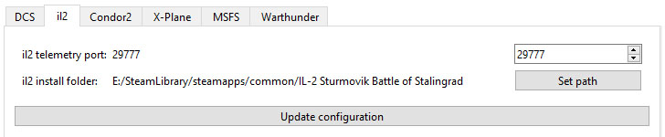
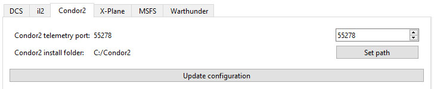
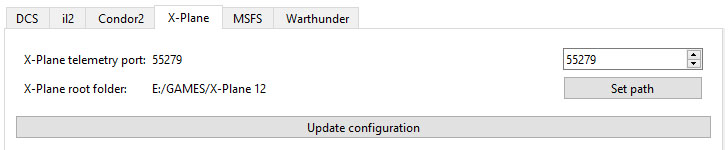

- TOC
{:toc}

---
Allows to setup games without need to edit and copy/paste files manually.

## DCS
Needed files will be copied to the **_Scripts_** folder and changes will be made to **_Export.lua_**.

- Select port that is not used by other telemetry sources.
- Select path to your **SavedGames/DCS** folder.
- Press **Update configuration.**
- Restart FFBeast Commander.

{: .important}
> **Path should be to SavedGames! Not to DCS install folder!**  

## Il-2
Changes will be made to **_startup.cfg_** file.

- Select port that is not used by other telemetry sources.
- Select path to your **il-2** root install folder.
- Press **Update configuration.**
- Restart FFBeast Commander.

## Condor
Changes will be made to **_UDP.ini_** file.

- Select port that is not used by other telemetry sources.
- Select path to your **Condor** root install folder.
- Press **Update configuration.**
- Restart FFBeast Commander.
- 
## X-Plane
Needed plugin file will be copied to the **_plugins_** folder.

- Select port that is not used by other telemetry sources.
- Select path to your **X-Plane** root install folder.
- Press **Update configuration.**
- Restart FFBeast Commander.

## MSFS

No configuration needed.

## Warthunder

No configuration needed.