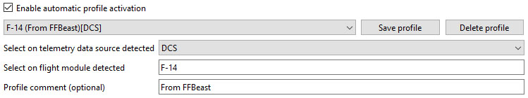

- TOC
{:toc}

---

## Intro

This section of the UI allows to create multiple profiles of effects and switching between them.

- **Enable automatic profile activation** checkbox turns on and off automatic switching of profiles in case 
if module detected by telemetry has dedicated profile. 
When unchecked, last selected profile will be active no mater which module is detected by telemetry.
- **Dropdown** have list of all profiles available. Profiles are stored in _**effect_profiles**_ folder.
- **Save profile** button saves profile with name name combined of three fields below.
- **Delete profile** deletes profile selected in dropdown
- **Select on telemetry data source detected** indicates the game with which profile will be associated
- **Select on flight module detected** indicates the module with which profile will be associated
- **Profile comment** could be any message helping to distinguish profiles

## Naming and auto detection

FFBeast Commander tries to find the profile associated with module detected by telemetry each time such detection occurs.
Matching happens by combination of game and part of module name. If two profiles are present for given combination, first in the list is auto selected.

{: .important}
> Module matching logic is still in WIP state and subject to change in next versions.
>
> - **In 24.1.5 matching happens by EXACT name!** 
> - Check that name of module reported by telemetry is the same as put in **Select on telemetry data source detected** field. 

{: .highlight-title }
> **Example 1**
> - **Enable automatic profile activation** checkbox is checked.
> - List contains profile **F-14** with telemetry data source **MSFS** selected.
> - **DCS** is running and detects **F-14** module.
> - Profile will not be matched and not selected automatically(game does not match).

{: .highlight-title }
> **Example 2**
> - **Enable automatic profile activation** checkbox is checked.
> - List contains profile **F-14** with telemetry data source **DCS** selected.
> - **DCS** is running and detects **F-14A** module.
> - Profile will be matched and selected automatically(part of the name matches in profile name to running module).

{: .highlight-title }
> **Example 3**
> - **Enable automatic profile activation** checkbox is checked.
> - List contains profile **F-14** with telemetry data source **DCS** selected.
> - **DCS** is running and detects **F-14** module.
> - Profile will be matched and selected automatically.

## Creating new profiles

Each time when **Save profile** button is pressed profile is saved.
If data source, name, or comment was changed - new profile will be created. 
Otherwise profile will override existing.

{: .highlight-title }
> **Example 1**
> - Existing profile with telemetry source **DCS**, module name **F-14** and empty comment is selected.
> - Changes are made in effect settings.
> - **Save profile** button is pressed.
> - Changes will **OVERWRITE** existing profile!

{: .highlight-title }
> **Example 2**
> - Existing profile with telemetry source **DCS**, module name **F-14** and empty comment is selected.
> - Changes are made in effect settings.
> - Some comment added.
> - **Save profile** button is pressed.
> - Changes will be saved in **NEW PROFILE!**