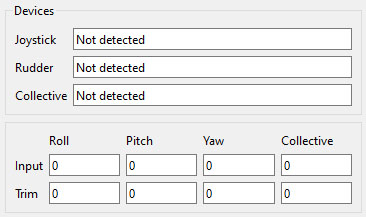

- TOC
{:toc}

---

Status section could be helpful in case you want to know what's happening with hardware 

- **Devices** section shows if devices are connected and their versions. 
- **Input** shows raw input from devices. It is clear from trim and shows position in range -1 to +1 from physical central position.  
- **Trim** shows state of hardware trim inside FFBeast Commander.