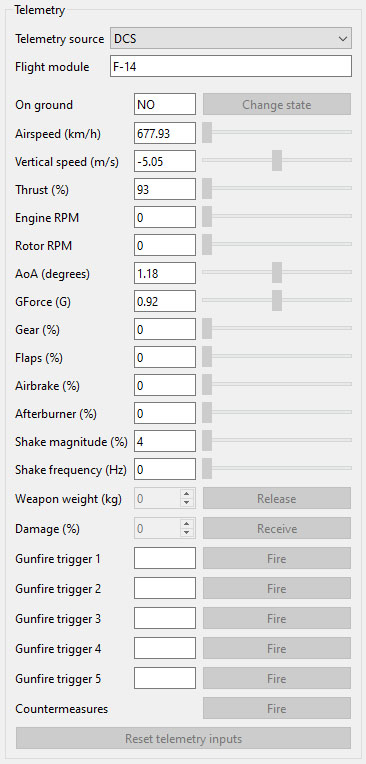

- TOC
{:toc}

---

## Telemetry source
- Allows to select specific telemetry mode to be able read telemetry from games.

{: .important}
> There is a mode which allows to detect which game is running. 
> But using that mode can cause some stutters when no game is running.
> It is recommended to use specific mode for the game.   

{: .important-title}
> Known issue
> 
> Sometimes when **Auto** or **MSFS** mode is selected and game is not running uneven forces can be produced on the stick.

## Module
- In case if telemetry is able to read module name data it will be shown here.
- Use the name from the field for the [**profile name.**](ffbeast_commander_profiles.html#naming-and-auto-detection)

## Debug
- Section allows to emulate telemetry data and test profiles without the need to run any of games. 
- Select **Debug** mode to enable controls for telemetry values. 
- Change telemetry values in order to test specific effect.