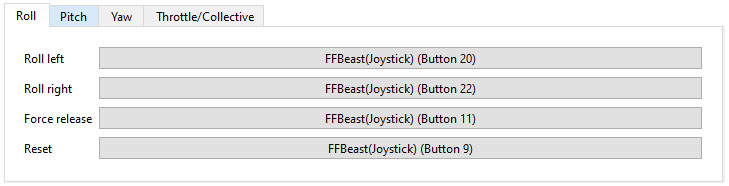

This tab allows to setup buttons for specific trim functionalities.

{: .important-title}
> **Important**
>
> In order to have functionality  working [**Hardware trim**](ffbeast_commander_effects.html#hardware-trim) effect must be added for specific axis. 

{: .important-title}
> **Tip**
> 
> You can assign one button for different axes. For example **Force release** and **Reset** buttons can 
> simultaneously work on  **Roll/Pitch/Yaw** axes.

{: .important-title}
> **Known issue**
> 
> Button assignment picks first pressed button. So if there are som panels with constantly pressed buttons it will be picked immediately.
> 
> **Workaround:** edit **_config.ini_** file for manual button assignment. 