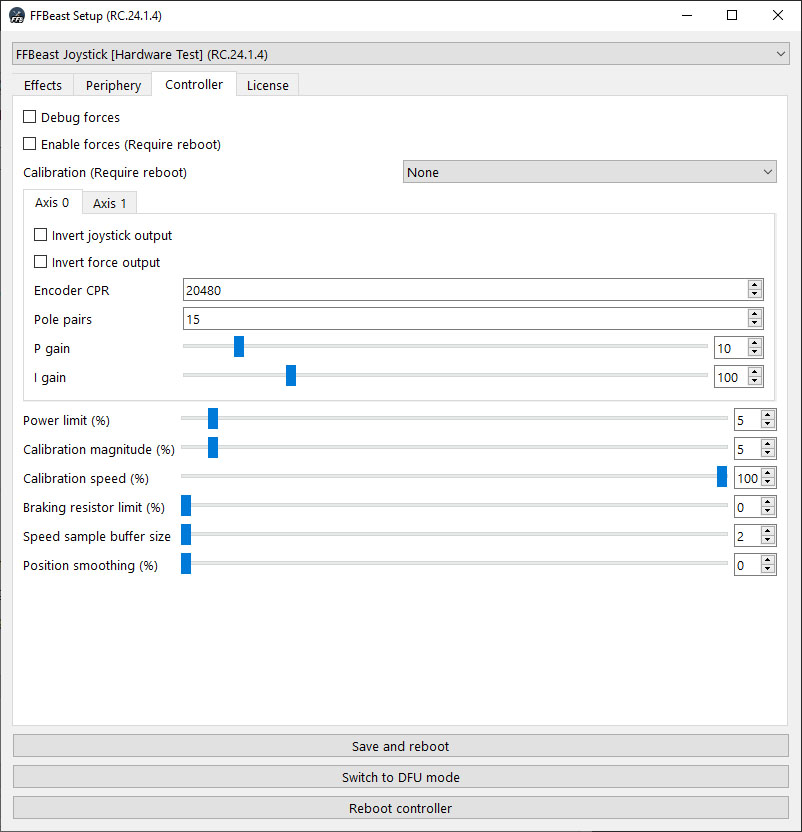

- TOC
{:toc}

---

## Common

### Debug force

This checkbox enables debugging forces calculated for axes in joystick axes.
When enable, slider axes will be changing their values according the forces.
You can check output with [**VkbJoyTester**](downloads_utils.html) as it has good visual representation of joystick
outputs.

### Enable force

This checkbox enables forces on motors. When unchecked device will not be producing forces.

### Calibration

Mode of initial calibration sequence

- None - calibration sequence is skipped during start. Should not be used if force is enabled.

- Start as the center - system consider position of control during powering up as the center.
  When calibrating only small movement is performed for determining motor rotation direction.
  This mode should be used when device do not have hard stops (for example wheel).

- Automatic center of range - system performs full calibration sequence by moving control through full
  range of motion and consider center to be in the middle of available range. This mode should be used when device have
  hard stops (for example joystick).

{: .important }
> **Device will be visible as USB device only after full calibration sequence passes. In case device stack in
calibration sequence it will not be enumerated as USB device!**

### Power limit

Controls overall power of the device. This parameter depends on PSU power and motor heating.

{: .important }
> **You need to tune this value specifically for your combination of motors and PSU!**
>
> Increase this value
> by small margin at once (5-10 clicks) and check if PSU holds load at high forces and motor do not overheat.
> If PSU starts turning of at high load or motor overheats - decrease power limit several clicks. 

### Calibration magnitude

Power with which starting calibration sequence is performing.
You need to set it as low as possible where calibration sequence still performs successfully.

{: .important }
> Value to start for wheel - 5, for flight controls - 10. If your device have some resistance to moving - increase it in small increment.

### Calibration speed

Speed of movement during calibration. 

{: .important }
>If control moves too quickly during calibration - decrease the speed to adequate values.

### Braking resistor limit

As motor works like a generator when turned quickly voltage in power bus rises. 
It can cause PSU (depending on characteristics of it) turn off because of overvoltage protection.
Dissipating excessive voltage on braking resistor helps to prevent it.
Parameter controls how much power to dissipate on resistor.

{: .important }
> What is correct value? **Depends on your motor and PSU!**
> Setup of the parameter requires a bit of trial and errors.  
> The best approach is to start from smaller value(5-10) and try to play.
> If during quick rotations left-right PSU keep working - it’s done.
> If no - increase it by 5-10 percents and repeat.

### Speed sample buffer size

When encoder with low CPR (6000 and less) is used calculation of dampening effect can produce some noise in the force.
Adding some buffer size will improve speed calculation. Set it as low as possible, controlling (check [debug force](ffbeast_setup_controller.html#debug-force)) 
there is no noise when dampening effect is used. If noise is there - increase buffer size. 

### Position smoothing

Add some smoothing to position reading from encoder. Keep it as low as possible unless position reading are not smooth. 

{: .important }
> For most encoders it can be set to 0. It is more "last resort" setting and should not be used in normal situations.  

## Axis setup

### Invert joystick output

Controls direction of joystick output. It changes how joystick values will be changing in joy viewer only!

{: .important }
> To make life easier, direction of joystick input should follow direction of the wheel or flight controls movement.
> [**JoyTester**](downloads.html) will help us do the job. Check if marker in joy viewer goes to the same direction
> where wheel rotates.
> If it goes in opposite direction - check **Invert joystick output** option.

### Invert force output

Controls direction of force. It changes force direction independently from joystick output!
If you feel force pulling wheel or joystick to wrong direction you need to change the state of checkbox.

{: .important }
> You can use soft stops as source of force for checking direction:
> - Set power limit to low value (10-15).
> - Set motion range to low value (30-40).
> - Move wheel/joystick to the limit of range.
> - Check if soft stop works in correct direction. If no - invert the state of the checkbox.

### Encoder CPR

Encoder [**CPR**](hardware_encoder.html#what-is-pprcpr) from encoder datasheet.

### Pole pairs

Number of pole pairs or your motor.

{: .important }
> Number of magnets divided by 2.

{: .important }
> Howerboard motor usually have **15 pole pairs**.

### P gain / I gain

{: .important }
> **Default value is a good starting point!**

{: .important }
> To tune this parameters you need to understand what is PID algorithm.
> Those are parameters of PID controller for current induced on the motor.
> Input parameter is requested torque, targeted value is PWM duty cycle.
> For details what is PID controller and how it works watch youtube videos on the topic.

## Initial setup algorithm

- Start from [**Pole pairs**](ffbeast_setup_controller.html#pole-pairs) and [**Encoder CPR**](ffbeast_setup_controller.html#encoder-cpr). Input correct values for your system.
- Select [**Start as the center**](ffbeast_setup_controller.html#calibration)calibration mode. It is good for initial check as performs quickly.
- Set [**Power limit**](ffbeast_setup_controller.html#power-limit) to low value. 10 is good for start.
- Set [**Calibration magnitude**](ffbeast_setup_controller.html#calibration-magnitude) value. 10 is good for start.
- Check [**Enable force**](ffbeast_setup_controller.html#power-limit).
- Press **Save and reboot** button.

After reboot the device will perform calibration sequence and be ready for [**joystick output direction**](ffbeast_setup_controller.html#invert-joystick-output) setup and [**force direction**](ffbeast_setup_controller.html#invert-force-output) setup.
After setting correct settings for directions set desired level of [**Power limit**](ffbeast_setup_controller.html#power-limit), [**Braking resistor limit**](ffbeast_setup_controller.html#braking-resistor-limit) and you are ready to go!
