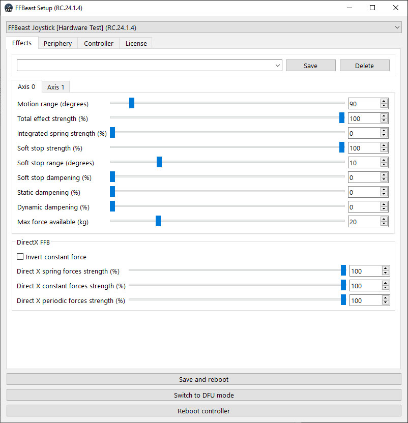
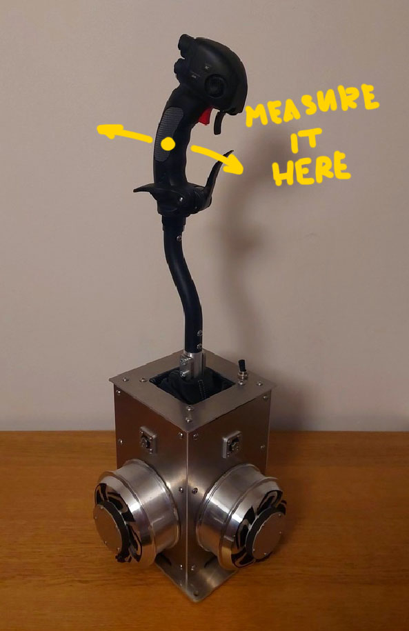

- TOC
{:toc}

---

{: .important }
> **Note all settings available for all types of devices and license types!**
> 
> Check settings that your device have available.

## Axis setup

### Motion range

Range of motion where device reports value change on joystick axis.

{: .important }
> Range corresponds the **range of encoder** movement! If you have reductions in your device you need to take it into account.

### Total effect strength

Main slider to control force strength on axis.

### Integrated spring strength

From version 24.1.4 there is a possibility to have spring always working. Slider controls strength of such integrated spring.

### Soft stop strength

Strength of effect emulating stops ath the end of motion range.

### Soft stop range

Range where soft stop force rises. If you have too "hard and springy" soft stop - increase this range.

### Soft stop dampening

Adds some extra dampening when control reaches end of motion range

### Static dampening

Add dampening force in normal range of motion. Static dampening determine movement of control and tries to resist it.
Static dampening is always constant.

### Dynamic dampening

Additional dampening force in normal range of motion. Dynamic dampening is not constant and depends with some complex rule on overall force produced by device and works in combination with effect calculation
performed by [**FFBeast Commander**](ffbeast_commander.html)

{: .important }
> Dynamic dampening do not have any effect if [**FFBeast Commander**](ffbeast_commander.html) is not running.

### Max force available (Flight controls only!)

Real maximum force measured on the stick at the center of grip when 100% force is applied.

As **FFBeast** project is open for building devices with different kinematic schemes and motors, each and every
device have different capabilities to produce forces on the stick. To take it into account some "scaling" parameter was needed.
By setting this parameter we are telling the device how much real force on the stick it can produce. 
When [**FFBeast Commander**](ffbeast_commander.html) requests to produce **forces in (Kg)**, the device knows 
how much of **power in (%)** it need to apply to motors in order to have correct force on the stick.

{: .highlight-title }
> **Example**
>
> - Real measured force that device can produce is 12Kg and set as the **Max force available.**
> - [**FFBeast Commander**](ffbeast_commander.html) as result of effect calculation gives a signal to produce on the stick 5Kg of force.
> - Device divides requested 5Kg by measured 12Kg and understands that it needs to apply around 47% of power to get exactly 5Kg of force at the grip level. 

By setting this parameter as not as **"true measured value"** it is possible to change device response to be softer or harder. If value set is **HIGHER** then real measured force, device will be **SOFTER**, and vice versa.

{: .highlight-title }
> **Example**
>
> - Real measured force that device can produce is 10Kg
> - **Max force available**  is set as 20Kg ignoring real measured.
> - [**FFBeast Commander**](ffbeast_commander.html) as result of effect calculation gives a signal to produce on the stick 5Kg of force.
> - Device divides requested 5Kg by 20Kg and makes decision, that it needs to apply around 25%.
> - But real force at 25% of power will be only 25% of measured 10Kg -> 2.5Kg. So stick will be softer comparing to what is asked by Commander.

{: .important }
> Try to keep **Max force available** set correctly for your device! Especially if you plan to share your profiles with others. 
> It will ensure other users will feel the same force distribution as you see them on their devices!    

## DirectX

Parameters have effect only on native DirectX FFB effects. 

- **Invert constant force** - Some games communicate forces via constant force effect inverted, and do not provide possibility to change it in game.
For that case inverting force there will help.

- **Spring force strength** - Strength of all spring effects
- **Constant force strength** - Strength of constant force effects.
- **Periodic force strength** - Strength of periodic effects (vibrations, shakers and so on).