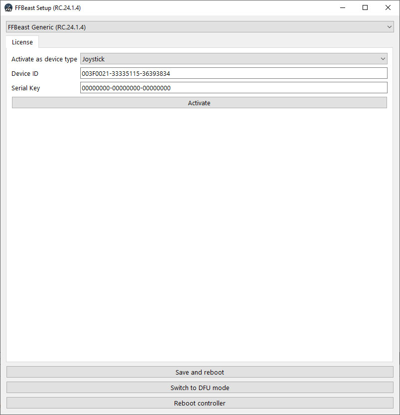

Here you can activate device in specific mode or switch device from **Light** or **Hardware test** mode to the **Premium mode**.

## Device ID

Identificator of ODrive controller to which license is bound. You will need to provide ID of your ODrive when purchasing a license.

## Activation
To activate a device select device type in dropdown list, input serial key (in case you have one), and press **Activate** button.

## Light mode (Wheel only!)

- By default wheel firmware is activated in light mode, it has basic wheel functionality needed to build a wheel. 
For extended functionality you will need to have [**proper license key**](shop_wheel_license.html). 

## Hardware test mode (Flight controls only!)
- Without a valid KEY device you can activate any flight controls in **Hardware test mode**.
In this mode all settings are available so you can perform initial setup and tests without a need to [**purchase a license**](shop_flight_controls_license.html). 
- The only restriction of the mode is that device will act as simple spring joystick and will not react on DirectX FFB and FFBeast commander commands.

## License key
- License key is connected to serial number of STM32 controller used in ODrives. 
- In case you will burn a chip license will be lost. So treat your ODrive carefully: 
 do not make short circuits, reverse power polarity and other "wrong things" in terms of electronics.
Secure and isolate all wires and your ODrive will work forever! 
