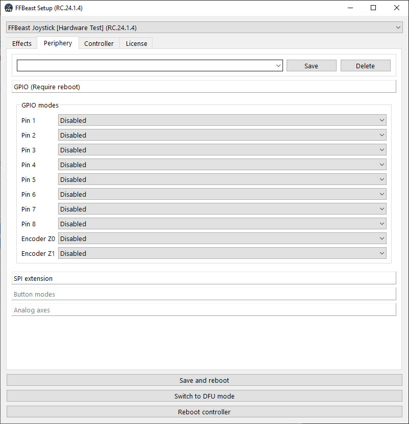
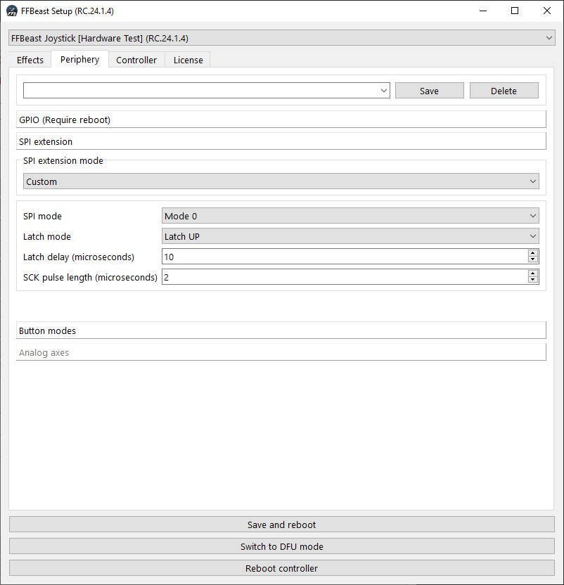
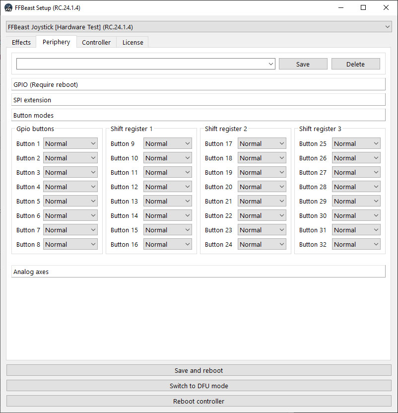
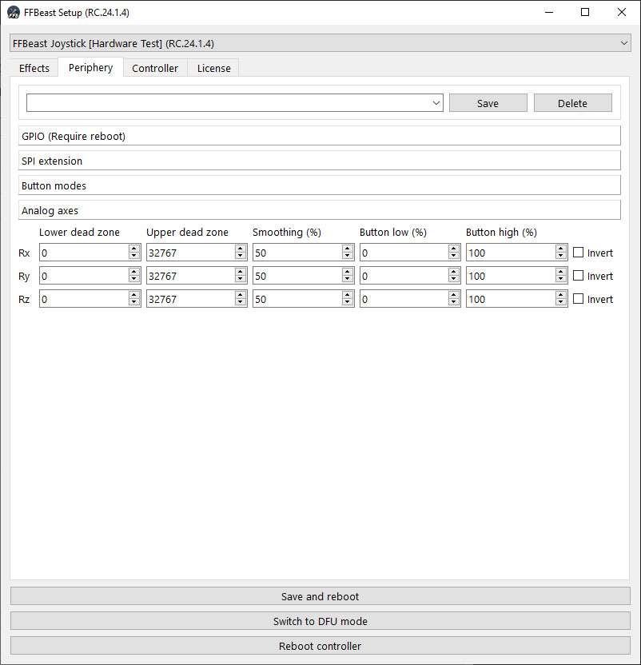
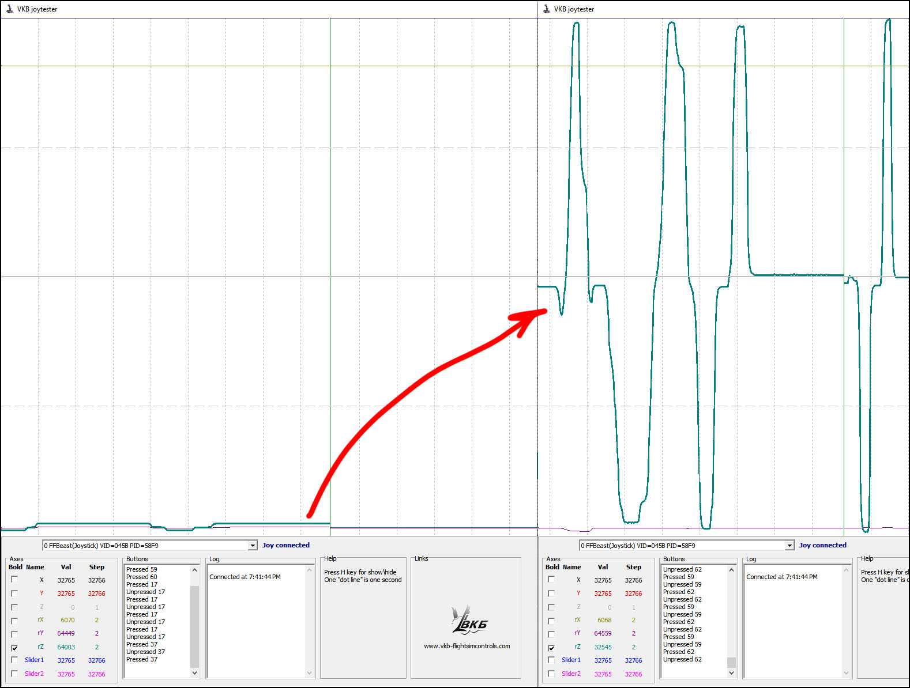

- TOC
{:toc}

---

Periphery tab allows to setup extensions connected to the ODrive. 

{: .important }
> Check possible [**wiring options**](connection_odrive.html#optional-connections) 

## GPIO

Before using any pin as additional input it need to be configured there.

- **Disabled** - pin not functional.
- **Generic button** - pin works as simple digital input. Pin internally is pulled up for OFF state. Pull to GND for ON state.
- **Analog** - pin works as ADC and read input as analog value 0 to 3.3v.
- **SPI CS** - chip select pin for SPI interface.
- **SPI SCK** - clock pin for SPI interface.
- **SPI MISO** - data pin for SPI interface.
- **Enable effects switch** - pin works as effect switch. When pulled to GND all effects are disabled. Otherwise effects are active.
- **Reset center button** - pin works as reset center button. Pin internally is pulled up for OFF state. Pull to GND for 1sec to trigger reset.
- **Braking PWM** - outputs PWM for controlling external mosfet. Output the same PWM as AUX. Used in older ODrives which do not have AUX circuit onboard. 
- **Effect LED** - not implemented.
- **Reboot** - pin works as reset center button. Pin internally is pulled up for OFF state. Pull to GND for 1sec to trigger reboot.

## SPI

There is an option to connect SPI extension boards and TM/VPC grips [**directly to the ODrive**](connection_odrive.html#connecting-spi-extensions). Select proper SPI mode there.

## Buttons

When combination of GPIO and SPI allows to have separate buttons this tab will be active. You can change modes for individual buttons here.

## Analog

When combination of GPIO and SPI allows to have additional analog axes this tab will be active.
In most cases analog inputs will cover just small part of the joystick axis range. 
Axes need to be adjusted there to work on full range. In addition button presses could be triggered when axis passes low and high button thresholds.

**Algorithm of adjusting dead zones:**

- Use [**VkbJoyTester**](downloads_utils.html) as the tool for checking axis range before dead zone adjustment
- Move control which change axes value from min to max.
- Note min and max value numbers for corresponding axis.
- Divide values by **2** and put them in **lower dead zone** and **upper dead zone** fields correspondingly.
- Set **button low** and **button high** thresholds for value you want button be triggered.

Now additional axis should be working full range.

