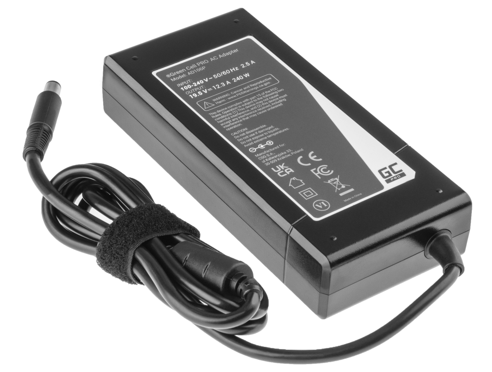
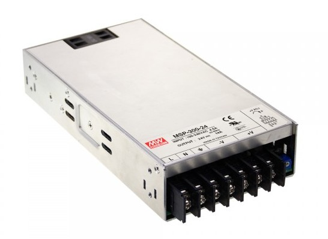
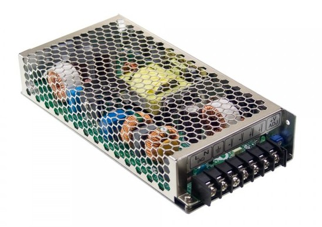
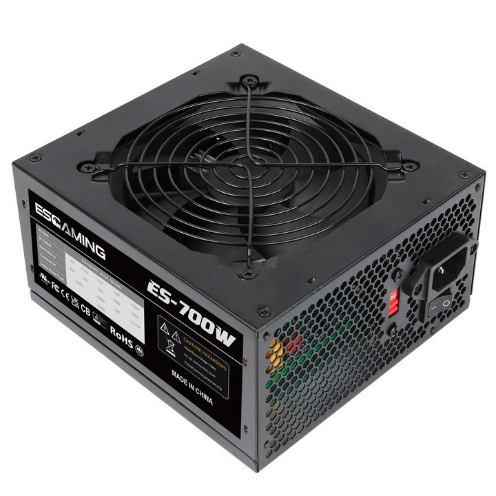

- TOC
{:toc}

---

## PSU Voltage

Situation with PSU voltage is pretty straightforward. You can use any PSU with voltage starting from 12V 
up to the voltage which your ODrive is rated.  For example, if your ODrive is 56V version you can use PSU with voltage in range 12V-56V.

## PSU Power

Here situation is a bit more complicated. Total PSU power needed depends on how you plan to use your device. 

### Conservative forces
If you plan to use devices in more conservative way, you can start with 240W-250W PSU. Personally I use 240W both for wheel and joystick 
on medium forces and it is totally enough for me. Big plus for starting with conservative approach that you can have desktop 
PSU totally enclosed into case without having open terminals.  

Candidates: 
- Dell laptop PSU 19.5V 12.3A (240W) or similar.
- MeanWell GST280A15
- MeanWell GST360A15

**Pros:**
- aesy to use
- plastic enclosure
- no open terminals
- silent

**Cons:**
- only enough for medium forces ([**unless is not used in parallel**](hardware_PSU.html#pairing_psu_for_more_power) )

### Absolute maximum

If your plan - to get absolute maximum from each motor - you should consider 300W+ for one motor. 
Such high powers are not available in desktop versions, so you will need to use modular PSU. 
There is wide variety of them, just make sure that power is at least NUMBER_OF_MOTORS * 300 watt. 
Trusted brand there is MeanWell, but a lot of people successfully use cheaper options from Amazon or Aliexpress.

Candidates:
- powerful PC ATX PSU
- modular
- powerful LED PSU

**Pros:**
- you can get them in any power needed

**Cons:**
- open construction
- open terminals
- need to wire them correctly
- usually have noisy cooler fan

## Pairing PSU for more power

Thanks god and physics we can combine less powerful PSU to get more power. What possibility it gives us? 
We can have all pluses desktop PSU combined with decent power without need to have open construction with open terminals. 
If having fully enclosed power source is critical for you - consider this option.

Here is a video illustrating the principle:

<iframe width="560" height="315" src="https://www.youtube.com/embed/WVK1tkCYy9U?si=z5hPbAxnW74FXhOT" title="YouTube video player" frameborder="0" allow="accelerometer; autoplay; clipboard-write; encrypted-media; gyroscope; picture-in-picture; web-share" referrerpolicy="strict-origin-when-cross-origin" allowfullscreen></iframe>

Specially for this case I've developed small PCB, which allows to connect two Dell laptop PSU in parallel. 
The project is open and available for all!

{: .important }
> The only important requirement is having two **IDENTICAL** PSU. Both voltage and power. 
> If one PSU will be weaker it will take load and turn off first, making the whole idea of parallel connection useless