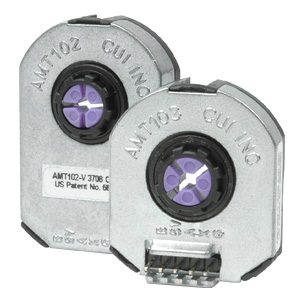
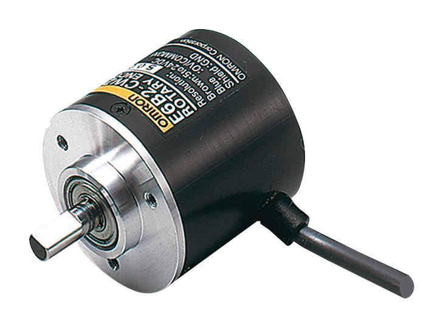
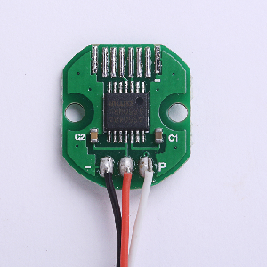

- TOC
{:toc}

---

## Supported encoder types

At present, the firmware exclusively supports **incremental types of encoders**. 
Theoretically, any incremental encoder should be compatible, whether optical, magnetic, or another type, 
as long as it outputs A/B impulses

{: .important }
> The **Z index is not utilized**, so it is not critical whether the encoder has it or not.

## What is PPR/CPR?

**PPR** - Pulses per rotation: Indicates the number of pulses generated by each channel (A or B) 
for one full rotation of the encoder.

**CPR** - Counts per rotation: Indicates the number of position counts that can be calculated 
from the encoder by combining the pulses from both channels (A and B).

Relation: **CPR = 4 x PPR**

{: .highlight-title }
> In the encoder datasheet, any of these values may be provided. Throughout the following text, 
> CPR (Counts Per Rotation) will be used. Therefore, if you encounter
> PPR (Pulses Per Revolution) in the datasheet for your encoder, simply multiply it by 4 to obtain the equivalent CPR.

## CPR requirements?
In general, the firmware is designed to work with any encoder. 
However, for optimal performance in tandem **with a hoverboard motor**, 
I recommend using an encoder with **1000 CPR or higher** when directly connected to the motor shaft **without reduction**. 
If the encoder is connected with a reducer, an encoder with lower resolution can be used.

{: .highlight-title }
>Example
>
>Encoder connected to the motor with reduction ratio 1:5. Minimum encoder CPR needed could be calculated as 1000/5 -> 200 CPR and more.

## Recommendations on purchase 

There are numerous encoders available on the market. Some have already been tested and are guaranteed to work. 
However, no direct links will be provided as they tend to become outdated quickly. 
Just use a search engine for the most up-to-date options.

### CUI - AMT 10x series

The most expensive yet highly reliable option available comes in a very compact form, and it is represented by several options:

- AMT-102 (8192 CPR)
- AMT-103 (8192 CPR)
- **AMT-10E2 (20480 CPR)**
- **AMT-10E3 (20480 CPR)**

I prefer last two options for my devices. As them cost the same as first two, but have higher CPR.

{: .important }
> These models feature different form factors with connector outputs to the front and bottom.
> Models marked with '2' are vertical, while models ending with '3' have a front connector.

### OMRON-style

Countless variants are there. All of them are "clones" of OMRON encoder. Different CPR available. Just some model are:
- E6B2-CWZ5B
- E6C2-CWZ6C
- 38S6G5-B-G24N
- E6B2-CWZ1X
- YT06
- etc...

{: .important }
> **Verify the power requirements and needs of pull-down or pull-up for the encoder!**
> 
> Not all encoders operate on a 5V supply; some may require 12V or even 24V. Additionally, check the datasheet 
> for the specific mode of your encoder and whether it requires 
> pulling the signal lines to ground or the power line.

### Magnetic encoders

This group operates on a common principle. 
Typically, it consists of a PCB with a small chip. To ensure proper functionality, 
a magnet must be carefully placed and centered on the motor shaft. 
The PCB should be precisely positioned along the axis of rotation of the magnet.
While it is the most economical option, mounting requires creativity as there is no standard solution. 
Here are some recommended options from this group:

- MT6701 (4096 CPR)
- MT6825 (16384 CPR)

{: .warning }
> **TLE5012B**.
>
>  TLE5012B (16384 CPR) encoders are not recommended. 
> These encoders have a programmed 'dead zone.' As a result, when changing direction, 
> they introduce a sense of backlash, negatively impacting the force feedback experience. 
> It's advisable to consider an alternative solution for a smoother experience.

{: .important }
> **Magnetic encoders are extremely sensitive to relative position to the magnet!**.
>
> Of axis magnet placement causes non linearity in calculated forces. Good article about it [**there**](https://www.akm.com/eu/en/products/rotation-angle-sensor/tutorial/angular-error/).
>
> So if you are not sure that you could mount encoder and magnet with good amount of precision - just **choose another solution!**

