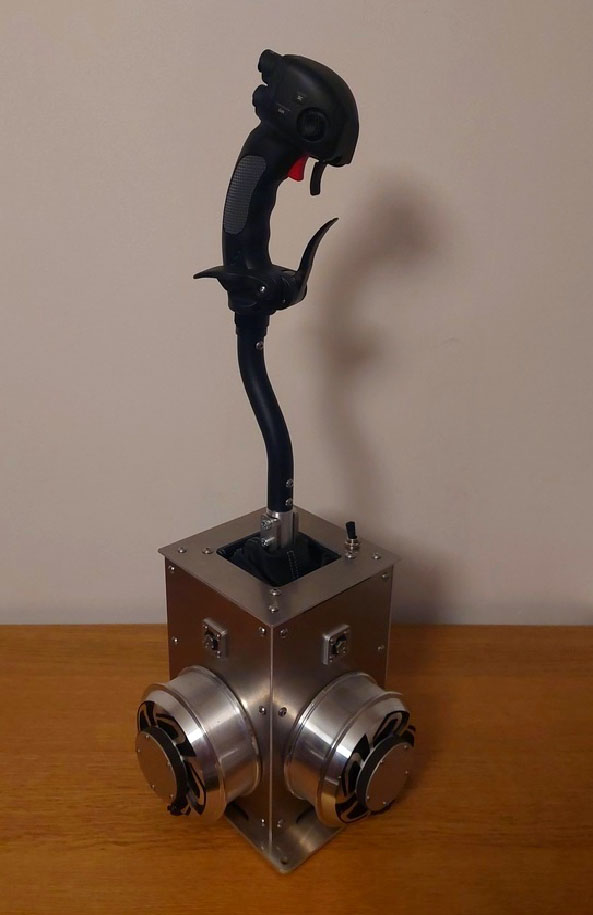
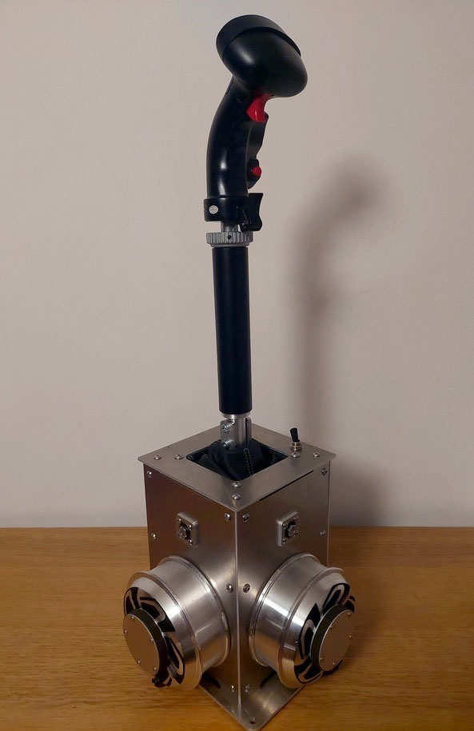

- TOC
{:toc}

---

## Intro to FFBeast!

In developing this project, my goal was to create a device that bridges the gap between the world of simulation and reality,
both in terms of a wide variety of supported effects and the ability to emulate forces as closely as real pilots
experience on their flight sticks.

For those of you who have looked with envy at the force feedback devices available for the sim racing community and
have dreamt about experiencing the same level of immersion, this device will finally open the window to a new world
for flight simmers.

{: .warning }
**Warning!** Playing flight simulators with **Force Feedback can be addictive!** Once you've experienced even a single
flight with FFB, you'll find yourself hooked, never wanting to return to using a traditional spring-loaded joystick again!

## Specs

 - 35Nm peak torque. It allows to achieve 8+ kg force on full length stick.
 - Full metal construction for maximum rigidity and durability.
 - Ball bearings an all moving joints.
 - Compatible with PSU from 12V to 24V.
 - Compatible with DCS, MSFS, il-2, Warthunder, Condor2.
 - Other games support is on roadmap.
 - Compatible with Thrustmaster and VKB extenders when using proper adapter.

## Gallery

## Want one?

There are several options:

### Build it! 
It is possible to build device yourself. Construction does not require use of special tooling and can be done by anyone
Technical documentation and firmware are available for purchase: 

- DXF files ready for cutting + BOM - **25 Euro**
- Firmware license for one device - **50 Euro**

**Building instructions will be added there soon!**

### Or buy it!
In case you want to have ready made device I could build FFBeast base for you.    
The final price is the subject of options selected. Expect to spend **899 Euro + Shipping** as starting minimum configuration.
 [**Just fill the form**](https://forms.gle/nyH7mn7TG4byqH4g7), and I will contact you with provided email as soon as your preorder will be ready to go to production.

## Discord
Discord is the preferred way to ask me questions and discuss project details. 
Join [**FFBeast server**](https://discord.gg/Gt6rnvrZKu) to become part of the community and to get latest news about the project.  

