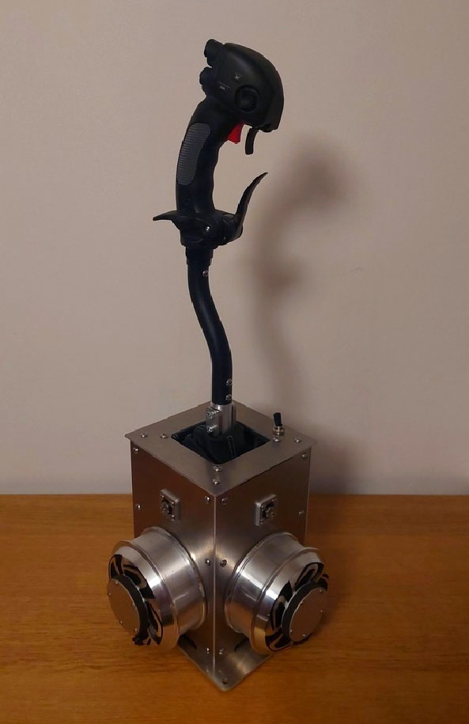
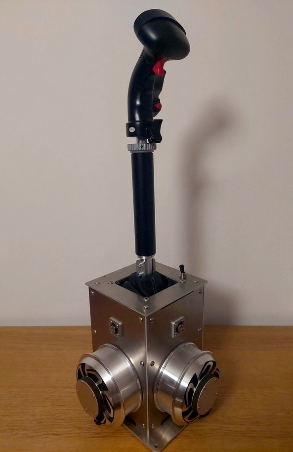

- TOC
{:toc}

---

<iframe width="720" height="480" src="https://www.youtube.com/embed/xtge1SGVlzA?si=RDobarisOLbw1zWy" title="YouTube video player" frameborder="0" allow="accelerometer; autoplay; clipboard-write; encrypted-media; gyroscope; picture-in-picture; web-share" referrerpolicy="strict-origin-when-cross-origin" allowfullscreen></iframe>
# Intro to FFBeast! ([Discord](https://discord.gg/5ZKD46zQSU))

In developing this project, my goal was to create a device that bridges the gap between the world of simulation and reality,
both in terms of a wide variety of supported effects and the ability to emulate forces as closely as real pilots
experience on their flight sticks.

For those of you who have looked with envy at the force feedback devices available for the sim racing community and
have dreamt about experiencing the same level of immersion, this device will finally open the window to a new world
for flight simmers.

{: .warning }
>**Warning!** Playing flight simulators with **Force Feedback can be addictive!** Once you've experienced even a single
>flight with FFB, you'll find yourself hooked, never wanting to return to using a traditional spring-loaded joystick again!

# Specs

 - High peak torque. It allows to achieve high force on full length stick.
 - Full metal construction for maximum rigidity and durability.
 - Ball bearings an all moving joints.
 - Compatible with variety of PSUs from 12V to 24V.
 - Compatible with DCS, MSFS, il-2, Warthunder, Condor2.
 - Other games support is on roadmap.
 - Compatible with Thrustmaster (Native support. No additional controllers needed).
 - Compatible with Virpil (Native support. No additional controllers needed).
 - Compatible with VKB (**In form of "Path through"**).

{: .important }
> **"Path through"**
> 
> Is the way of connecting grip to the original controller. 
> The cable will be routed from the extender outside of the box. 
> You will need to have original controller standing close to the base and cable connected to it. 

# Want one?

## Buy it!
In case you want to have ready made device you can purchase it at our [**FFBeast Official Store**](https://ffbeast-devices.com/).
No preorder, no waiting! Just plan your purchase and do it when you are ready.

## Build it! 
FFBeast proposes cosystem for force feedback enthusiasts and builders, so t is possible to [**build device yourself**](joystick_DIY.html). 
Construction does not require use of special tooling and can be done by anyone. 
You just need some time and passion to do it :)

## Or delegate building to third party vendor
If devices are not in stock at official store, you do not want to build them yourself - you can chose other vendor to build a device for you.

{: .important }
>If you are eager to build devices for other - build your trust and you will be in the list!

### GVL224
For a long time building FFBeast comapatible devices. He has both joystick, rudders, throttles and collectives. Visit [**his page**](https://gvl224.com/) for details 

