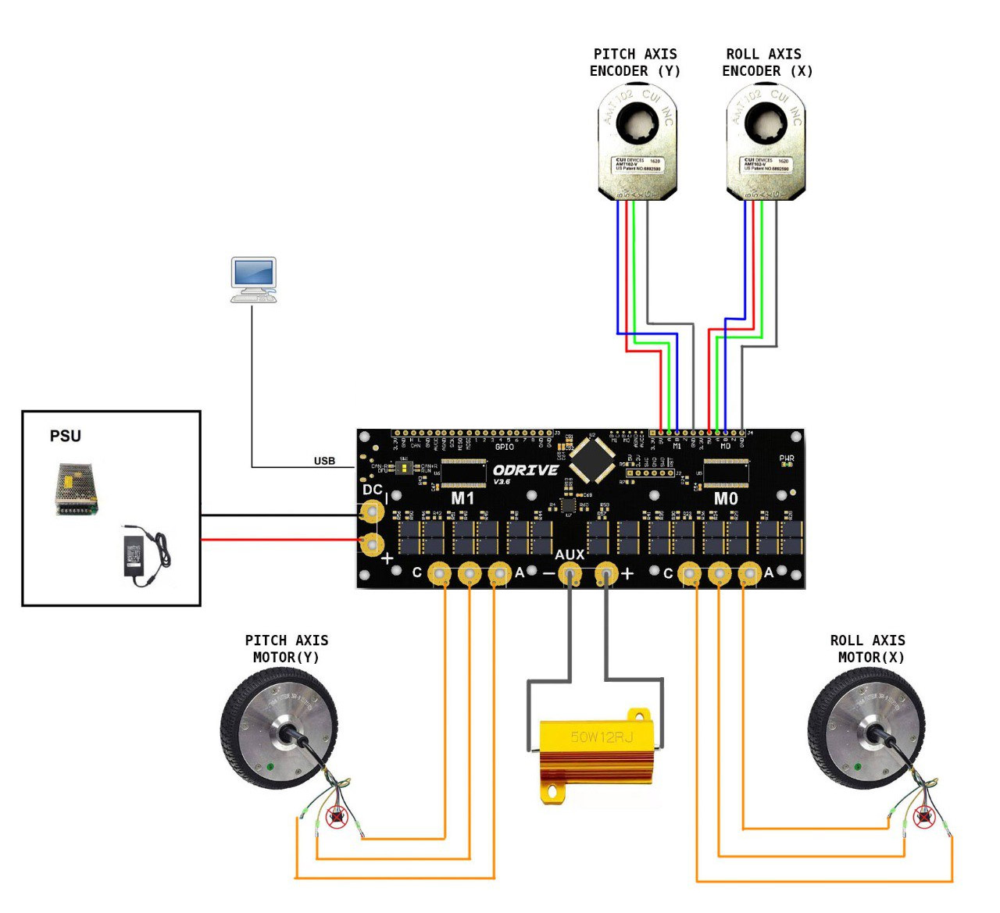

- TOC
{:toc}

---
# Intro
Technical documentation for DIY build and firmware are available for purchase. For details contact me by <a href="mailto:ffbeast.devices@gmail.com"><b>email</b></a> or in [**Discord**](https://discordapp.com/users/606515769542443019).

{: .important }
> **You will receive purchased package via email, sent to the address provided during checkout.** 
> 
>**In case you do not receive it within 24 hours, please reach out to me via personal message!**

{: .important }
> **Check [instruction where to get Device ID](../../assets/images/deviceId.jpg) for firmware license!**

<stripe-pricing-table pricing-table-id="prctbl_1OxSLhAUMJA5adUcwf9XqC0I"
publishable-key="pk_live_51N3FsMAUMJA5adUcbQwaE8tIDLRbB2bW94T4SqdYEUYhwdWbFbXKoHiOzETl6WpBpZRtQtBqq701Ug5q8gA1CVn500WyNLoWsx">
</stripe-pricing-table>

{: .important }
> If you plan to build and use it for other purposes then personal - contact me and we will find a solution! 

# Project preview
<iframe src="https://gmail2239807.autodesk360.com/shares/public/SH512d4QTec90decfa6e73dd6a088a09dc43?mode=embed" width="720" height="480" allowfullscreen="true" webkitallowfullscreen="true" mozallowfullscreen="true"  frameborder="0"></iframe>

# Wiring diagram

{: .important }
>Keep order of encoders and motors! 
> 
>Both axis need to be connected as on the picture! **Pitch** to **M1** and **Roll** to **M0**

# Software

Check [**download**](downloads.md) section, [**firmware flashing**](software_firmware_flashing.html) section,
and how to use [**settings app**](software_hardware_settings_ui.html).

# Building instructions
**Will be there soon!**

{: .important }
> For now you can follow [**excellent Discord topic**](https://discord.gg/3pc2Zuf7DW) where one of enthusiasts keep track of his real world experience with building it. 
