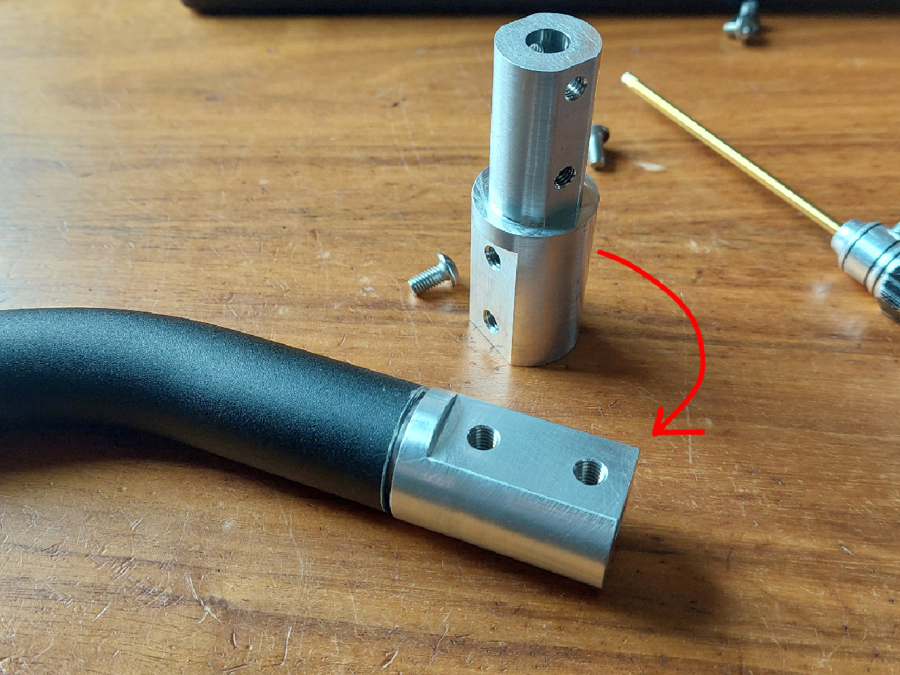
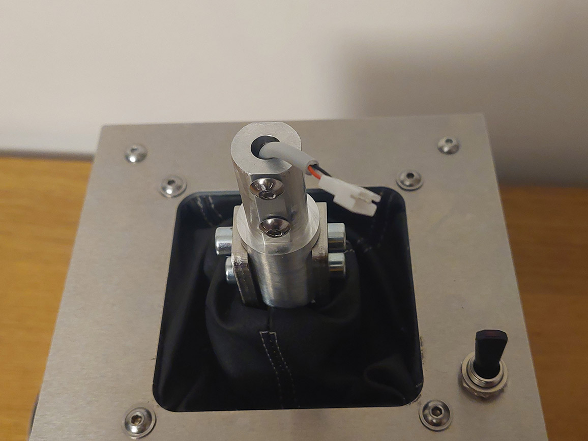
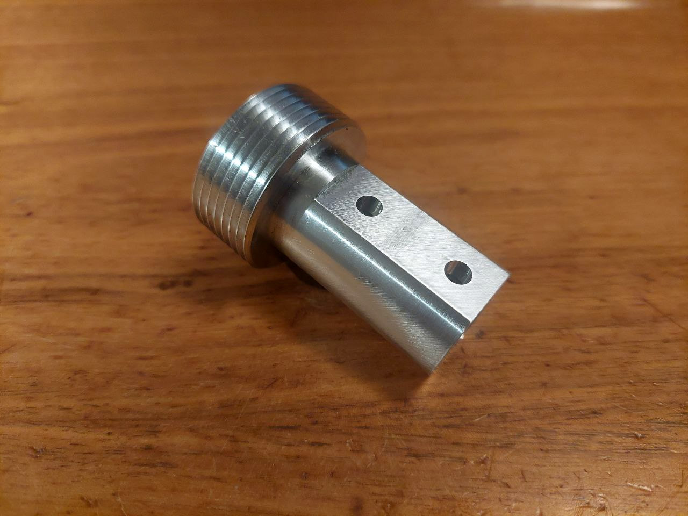
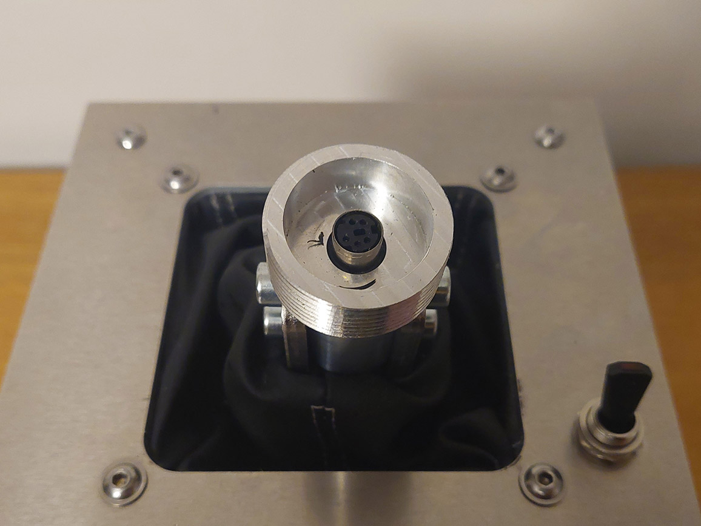

- TOC
{:toc}

---
# Intro
Technical documentation for DIY build and firmware are available for purchase. For details contact me by <a href="mailto:ffbeast.devices@gmail.com"><b>email</b></a> or in [**Discord**](https://discordapp.com/users/606515769542443019).

{: .important }
> If you plan to build and use it for other purposes then personal - contact me and we will find a solution! 

# Project preview
<iframe src="https://gmail2239807.autodesk360.com/shares/public/SH512d4QTec90decfa6e73dd6a088a09dc43?mode=embed" width="720" height="480" allowfullscreen="true" webkitallowfullscreen="true" mozallowfullscreen="true"  frameborder="0"></iframe>

# BOM

## Electronics

| Part name                                        | Quantity   | Comment                            |
|--------------------------------------------------|------------|------------------------------------|
| [**ODrive/ODESC**](hardware_controller.html)     | 1          | Dual axis version needed           |
| [**Encoder**](hardware_encoder.html) (AMT10E2)   | 2          | **AMT10E2 is highly recommended!** |
 | [**Motor**](hardware_motor.html)                 | 2          |                                    |

## Alu extrusions

| Part name | Length | Quantity | 
|-----------|--------|----------|
| 20x20     | 250    | 4        | 

## Sheet metal parts

| Part name                              | Quantity | Material    | Comment                               |
|----------------------------------------|----------|-------------|---------------------------------------|
| enclosure_back_side_panel              | 1        | alu - 3mm   |                                       |
| enclosure_bottom_plate                 | 1        | alu - 4mm   | could be other material and thickness |
| enclosure_connector_side_panel_odrive  | 1        | alu - 3mm   |                                       |
| enclosure_cover_bracket                | 4        | alu - 3mm   | to hold dust cover                    |
| enclosure_motor_mount                  | 2        | alu - 3mm   |                                       |
| enclosure_motor_side_panel             | 2        | alu - 3mm   |                                       |
| enclosure_top_plate                    | 1        | alu - 3mm   |                                       |
| square_bearing_block                   | 9        | alu - 2mm   | 8 for enclosure + 1 for gimbal        |
| gimbal_arm_bearing_block               | 1        | steel - 5mm |                                       |
| gimbal_arm_leg                         | 2        | steel - 5mm |                                       |
| gimbal_arm_stick_connector             | 2        | steel - 5mm |                                       |
| gimbal_core_center                     | 1        | steel - 5mm |                                       |
| gimbal_frame_core                      | 4        | steel - 5mm |                                       |
| gimbal_core_screw_aligner              | 3        | steel - 3mm |                                       |
| gimbal_frame_side                      | 4        | steel - 5mm |                                       |
| gimbal_pulley_spacer                   | 2        | steel - 6mm |                                       |
| round_bearing_block                    | 4        | steel - 2mm | alu will be ok as well                |

## Build specific sheet metal parts

Encoder mounting possible in two variants: inside the enclosure and on front of the motor.
Depending on it slight variation exists in BOM for those builds.
**You need to select only one variant from those options!**

### Encoder inside of enclosure sheet metal parts

| Part name                      | Quantity | Material        | Comment                                               |
|--------------------------------|----------|-----------------|-------------------------------------------------------|
| encoder_internal_drill_pattern | 1        | steel - 3mm     | **Optional** to help drill motor for encoder mounting |
| encoder_internal_plate         | 2        | alu - 3mm |                                                       |

### Encoder on motor front surface sheet metal parts

| Part name                      | Quantity | Material        | Comment                                               |
|--------------------------------|----------|-----------------|-------------------------------------------------------|
| encoder_external_drill_pattern | 1        | steel - 3mm     | **Optional** to help drill motor for encoder mounting |
| encoder_external_plate_Xholes  | 2        | alu - 2mm | X - depending on face of the motor: 5 or 6            |
| encoder_external_top_Xholes    | 2        | alu - 1mm | X - depending on face of the motor: 5 or 6            |

## Bearings

| Part name    | Quantity | Comment                        |
|--------------|----------|--------------------------------|
| 608 (8x22x7) | 9        | RS and ZZ version will be ok   |

## Reducer

| Part name          | Quantity| Comment                                                                                |
|--------------------|---------|----------------------------------------------------------------------------------------|
| HTD5M 60T pulley   | 2       | Must be exactly 20mm width and 8mm bore                                                |
| HTD5M 20T pulley   | 2       | 20-25 mm with 16mm bore                                                                |
| HTD5M-425 belt     | 2       | 15-16mm width in case pulleys have flanges, up to 20mm if pulley have full width teeth |

## Common Screws/Nuts

| Part name                          | Quantity | Comment                               |
|------------------------------------|----------|---------------------------------------|
| M8x30 tube coupling nut (ART.9290) | 2        |                                       |
| M8x25 (ISO 7380)                   | 3        |                                       |
| M8x20 (ISO 7380)                   | 2        |                                       |
| M8x50 (ISO 7380)                   | 4        | Could be other head type              |
| M8 thin (ISO 4035)                 | 9        |                                       |
| M8 (DIN 557 or DIN 934)            | 7        | Could interchange each other          |
| M6x30 tube coupling nut (ART.9290) | 2        |                                       |
| M6x20 tube coupling nut (ART.9290) | 2        |                                       |
| M6x10 (ISO 7380)                   | 20       | Could be other head type              |
| M6x16 (ISO 7380)                   | 4        | Could be other head type              |
| M6x35 (DIN 7991 or ISO 10642)      | 8        |                                       |
| M6 (DIN 557 or DIN 934)            | 16       | Could interchange each other          |
| M6 thin (ISO 4035)                 | 8        |                                       |
| M5x8 (DIN 912 or ISO 7380)         | 20       |                                       |
| M5x10 (DIN 912 or ISO 7380)        | 8        |                                       |
| M5x12 (DIN 7991 or ISO 10642)      | 4        |                                       |
| M5 T-Nut                           | 24       | Standard nut for slotted alu profiles |
| M4x10 (DIN 912 or ISO 7380)        | 44       |                                       |
| M4 (DIN 557 or DIN 934)            | 44       | Could interchange each other          |
| M3x8 (DIN 912 or ISO 7380)         | 4        |                                       |
| M3 (DIN 934)                       | 4        |                                       |

## Build specific Screws/Nuts

Encoder mounting possible in two variants: inside the enclosure and on front of the motor.
Depending on it slight variation exists in BOM for those builds.
**You need to select only one variant from those options!**

### Encoder inside of enclosure Screws/Nuts

| Part name                   | Quantity | Comment |
|-----------------------------|----------|---------|
| M4x10 (DIN 912 or ISO 7380) | 16       |         |
| M4x30 standoff              | 8        |         |

### Encoder on motor front surface Screws/Nuts

| Part name                   | Quantity | Comment                                    |
|-----------------------------|----------|--------------------------------------------|
| M3x6 (DIN 912 or ISO 7380)  | 5(6)     | value in () is for 6 rays motor front face |      
| M3x12 (DIN 912 or ISO 7380) | 5(6)     | value in () is for 6 rays motor front face |  
| M3x10 standoff              | 10(12)   | value in () is for 6 rays motor front face |

## Stick connectors

There are two options available. Choose one for extender you will be using. 
Both parts need to be made from metal

{: .important }
>If you do not have local shop that can produce such part, adapters could be ordered from [**JLCPCB CNC**](https://jlc3dp.com/cnc-machining-quote) service. 
> Them ask you for CAD fila and image with threads. 
> Those files are available in CAD package.

### VKB adapter

It is intended to be used with standard VKB extender. You will need to purchase extender from official VKB 
store if you do not have one. This part replaces lower part from original extender.  

### Thrustmaster style adapter

This adapter has standard M36x2 thread and  is intended to be used with all kinds of extenders compatible with Thrustmaster(and VPC).

# Building instructions
**Will be there soon!**

{: .important }
> For now you can follow [**excellent Discord topic**](https://discord.gg/jvdmCgNbqW) where one of enthusiasts keep track of his real world experience with building it. 
