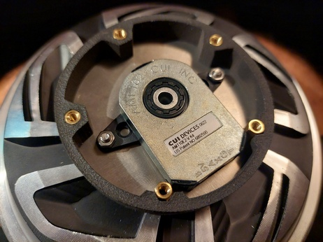
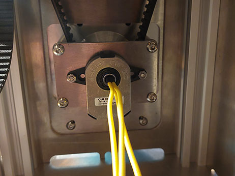

- TOC
{:toc}

---

# Electronics

| Part name                                        | Quantity   | Comment                            |
|--------------------------------------------------|------------|------------------------------------|
| [**ODrive/ODESC**](hardware_controller.html)     | 1          | Dual axis version needed           |
| [**Encoder**](hardware_encoder.html) (AMT10E2)   | 2          | **AMT10E2 is highly recommended!** |
| [**Motor**](hardware_motor.html)                 | 2          |                                    |

# Alu extrusions

| Part name | Length | Quantity | 
|-----------|--------|----------|
| 20x20     | 250    | 4        | 

# Common parts
This set is common for any variant of the build. 

## Common sheet metal
| Part name                              | Quantity | Material    | Comment                               |
|----------------------------------------|----------|-------------|---------------------------------------|
| enclosure_back_side_panel              | 1        | alu - 3mm   |                                       |
| enclosure_bottom_plate                 | 1        | alu - 4mm   | could be other material and thickness |
| enclosure_connector_side_panel_odrive  | 1        | alu - 3mm   |                                       |
| enclosure_cover_bracket                | 4        | alu - 3mm   | to hold dust cover                    |
| enclosure_motor_mount                  | 2        | alu - 3mm   |                                       |
| enclosure_motor_side_panel             | 2        | alu - 3mm   |                                       |
| enclosure_top_plate                    | 1        | alu - 3mm   |                                       |
| square_bearing_block                   | 9        | alu - 2mm   | 8 for enclosure + 1 for gimbal        |
| gimbal_arm_bearing_block               | 1        | steel - 5mm |                                       |
| gimbal_arm_leg                         | 2        | steel - 5mm |                                       |
| gimbal_arm_stick_connector             | 2        | steel - 5mm |                                       |
| gimbal_core_center                     | 1        | steel - 5mm |                                       |
| gimbal_frame_core                      | 4        | steel - 5mm |                                       |
| gimbal_core_screw_aligner              | 3        | steel - 3mm |                                       |
| gimbal_frame_side                      | 4        | steel - 5mm |                                       |
| gimbal_pulley_spacer                   | 4        | steel - 3mm | used as 2x per side to get 6mm spacer |
| round_bearing_block                    | 4        | steel - 2mm | alu will be ok as well                |

## Bearings
| Part name    | Quantity | Comment                        |
|--------------|----------|--------------------------------|
| 608 (8x22x7) | 9        | RS and ZZ version will be ok   |

## Reducer
| Part name          | Quantity| Comment                                                                                |
|--------------------|---------|----------------------------------------------------------------------------------------|
| HTD5M 60T pulley   | 2       | Must be exactly 20mm width and 8mm bore                                                |
| HTD5M 20T pulley   | 2       | 20-25 mm with 16mm bore                                                                |
| HTD5M-425 belt     | 2       | 15-16mm width in case pulleys have flanges, up to 20mm if pulley have full width teeth |

## Common Screws/Nuts
| Part name                          | Quantity | Comment                               |
|------------------------------------|----------|---------------------------------------|
| M8x30 tube coupling nut (ART.9290) | 2        |                                       |
| M8x25 (ISO 7380)                   | 3        |                                       |
| M8x20 (ISO 7380)                   | 2        |                                       |
| M8x50 (ISO 7380)                   | 4        | Could be other head type              |
| M8 thin (ISO 4035)                 | 9        |                                       |
| M8 (DIN 557 or DIN 934)            | 7        | Could interchange each other          |
| M6x30 tube coupling nut (ART.9290) | 2        |                                       |
| M6x20 tube coupling nut (ART.9290) | 2        |                                       |
| M6x10 (ISO 7380)                   | 20       | Could be other head type              |
| M6x16 (ISO 7380)                   | 4        | Could be other head type              |
| M6x35 (DIN 7991 or ISO 10642)      | 8        |                                       |
| M6 (DIN 557 or DIN 934)            | 16       | Could interchange each other          |
| M6 thin (ISO 4035)                 | 8        |                                       |
| M5x8 (DIN 912 or ISO 7380)         | 20       |                                       |
| M5x10 (DIN 912 or ISO 7380)        | 8        |                                       |
| M5x12 (DIN 7991 or ISO 10642)      | 4        |                                       |
| M5 T-Nut                           | 24       | Standard nut for slotted alu profiles |
| M4x10 (DIN 912 or ISO 7380)        | 44       |                                       |
| M4 (DIN 557 or DIN 934)            | 44       | Could interchange each other          |
| M3x8 (DIN 912 or ISO 7380)         | 4        |                                       |
| M3 (DIN 934)                       | 4        |                                       |

# Build specific parts

Encoder mounting possible in two variants: inside the enclosure and on outside on the front of the motor.
Depending on it slight variation exists in BOM for those builds.

{: .important }
>**You need to select only one variant from those options depending on which version of encoder mounting you choose!**

## Encoder internal mounting

### Sheet metal
| Part name                      | Quantity | Material  | Comment                                               |
|--------------------------------|----------|-----------|-------------------------------------------------------|
| encoder_internal_drill_pattern | 1        | any       | **Optional** to help drill motor for encoder mounting |
| encoder_internal_plate         | 2        | alu - 3mm |                                                       |

### Screws/Nuts
| Part name                   | Quantity | Comment |
|-----------------------------|----------|---------|
| M4x10 (DIN 912 or ISO 7380) | 16       |         |
| M4x30 standoff              | 8        |         |

## Encoder external mounting

### Sheet metal
| Part name                       | Quantity | Material         | Comment                                               |
|---------------------------------|----------|------------------|-------------------------------------------------------|
| encoder_external_drill_pattern  | 1        | any              | **Optional** to help drill motor for encoder mounting |
| encoder_external_plate_Xholes   | 2        | alu - 2mm        | X - depending on face of the motor: 5 or 6            |
| encoder_external_top_Xholes     | 2        | alu - 1mm        | X - depending on face of the motor: 5 or 6            |

### 3D prints
| Part name                       | Quantity | Material         | Comment                                               |
|---------------------------------|----------|------------------|-------------------------------------------------------|
| drill_pattern_centering_gage_3D | 1        | 3D print plastic | **Optional** to help drill motor for encoder mounting |
| encoder_enclosure_Xholes        | 2        | 3D print plastic | X - depending on face of the motor: 5 or 6            |

### Screws/Nuts
| Part name                   | Quantity | Comment |
|-----------------------------|----------|---------|
| M4x10 (DIN 912 or ISO 7380) | 16       |         |
| M4x30 standoff              | 8        |         |

# Stick extension
There are some options available. Choose one for extender you will be using. Those parts need to be made from metal.

{: .important }
>If you do not have local shop that can produce such part, adapters could be ordered from [**JLCPCB CNC**](https://jlc3dp.com/cnc-machining-quote) service.
> Them ask you for CAD fila and image with threads.
> Those files are available in CAD package.

## VKB adapter

It is intended to be used with standard VKB extender. You will need to purchase extender from official VKB
store if you do not have one. This part replaces lower part from original extender.

## Thrustmaster style adapter

This adapter has standard M36x2 thread and  is intended to be used with all kinds of extenders compatible with Thrustmaster(and VPC).
