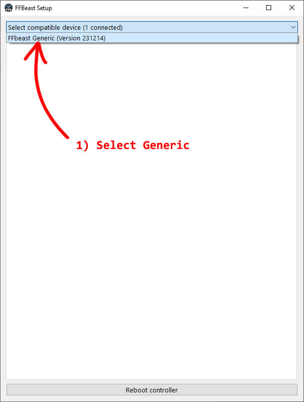
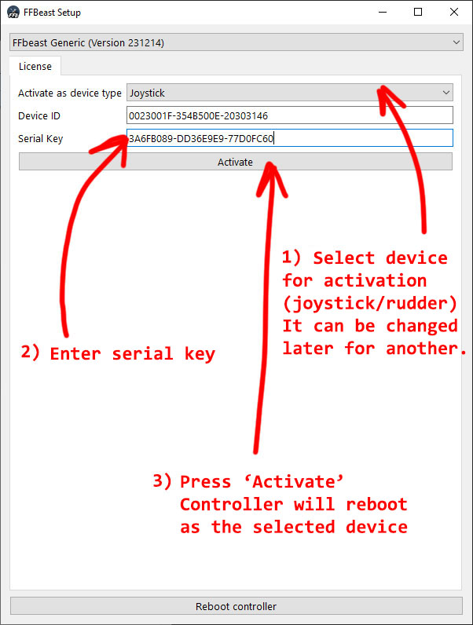
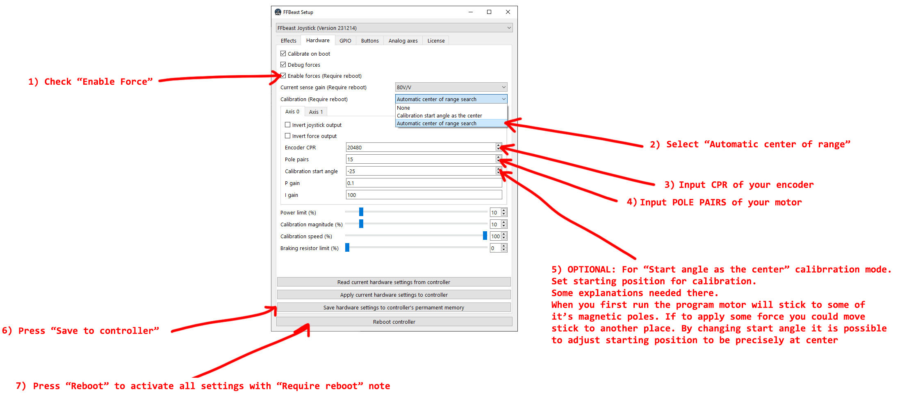
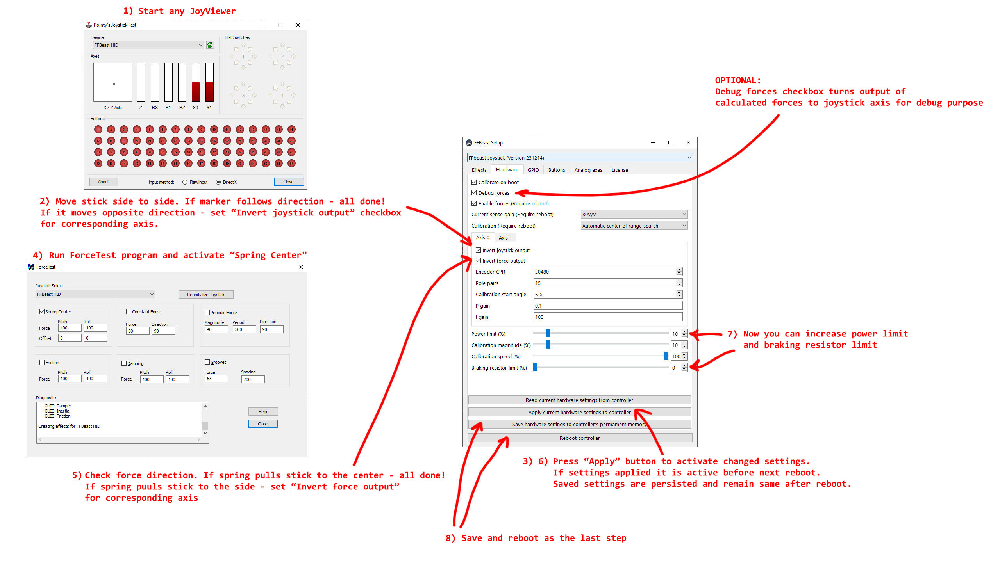

- TOC
{:toc}

---

After uploading firmware to ODrive hardware setup used for initial configuration. 

### Device activation

### Power stage setup

### Joystick and force direction setup

### Effects configuration

