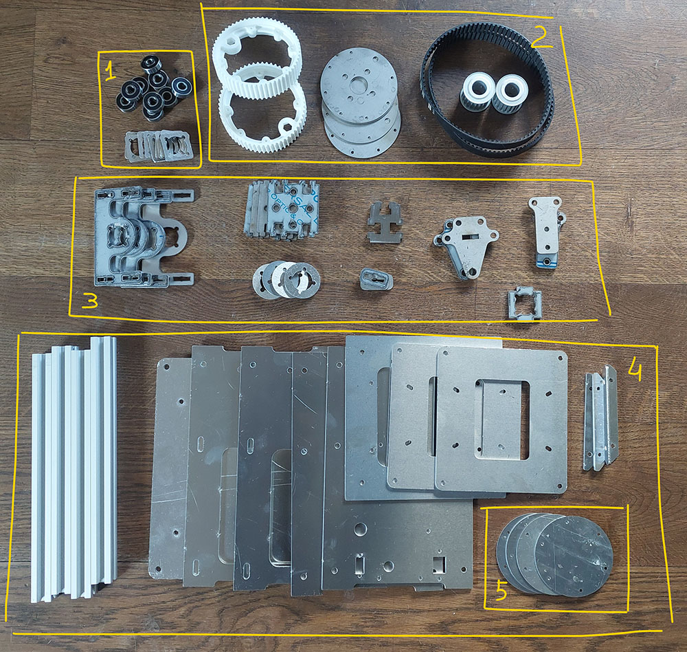
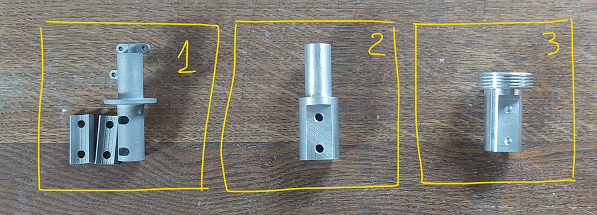
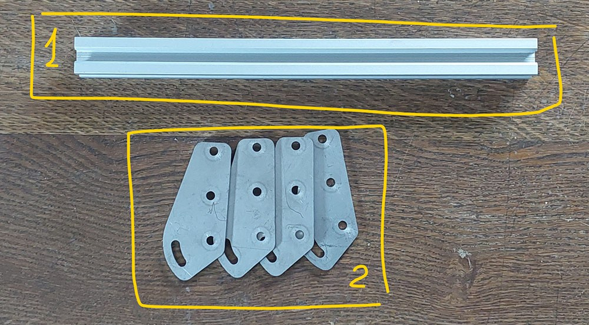

- TOC
{:toc}

---

For those who do not want to bother with searching places where to order metal parts and source other major parts separately I can propose a kits of them. 
All parts are as they come from machining shop. 
You will need to deburr/sand them on your own if needed.

Kit will include only parts on photo. You will need to obtain screws/nuts and electronic on your own according to the BOM.

## Base metal set

It includes basic set of metal/prints to assembly the base:
1. All needed bearings.
2. Pulleys and belts.
3. Gimbal parts.
4. Enclosure parts.
5. Covers for encoder for outside mounting.

Price for basic set is **249 Eur + Shipping**.

## Connection interfaces

In addition to the basic set there is an option of purchasing adapter interface:

### Interface for VKB MCG grip
3D printed of **stainless steel**. It is compatible with extender only and need to be mounted directly to MCG grip. Interface provides adjustable rotation angle 0-30 degrees.
Intended to be used with **adjustable extender**. 

Price is **49 Eur + Shipping**

### VKB extended interface
Machined of **aluminium**. Allows to use native VKB extender by replacing lower part of it and connecting it to the gimbal. 

Price is **29 Eur + Shipping**

### Thrustmaster/VPC style interface
Machined of **aluminium**. Gives option to connect Thrustmaster style grips and extenders either directly to the gimbal or to the **adjustable extender**. 

Price is **29 Eur + Shipping**

## Adjustable extender kit

This kit allows to assembly adjustable extension that from bottom side will be connected to the gimbal,
and on top part will have either **interface for VKB MCG grip** or **Thrustmaster/VPC style interface**.

1. Alu profile. Need to be cut in half with proportion that suits your need in length and offset of extender.
2. Brackets holding profiles together.

Price is **49 Eur + Shipping**