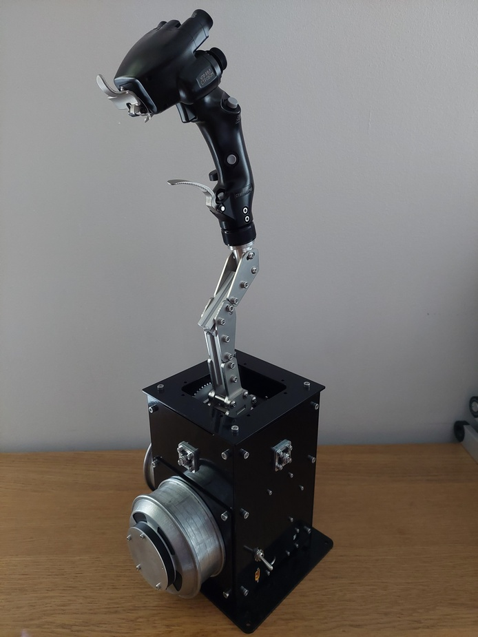
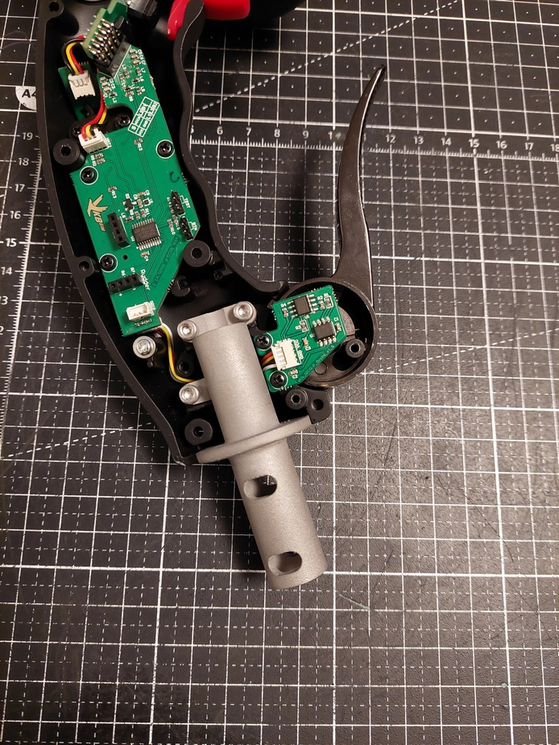
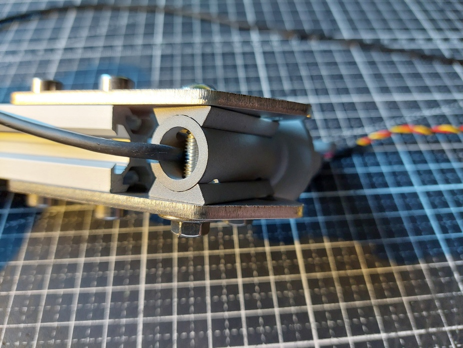
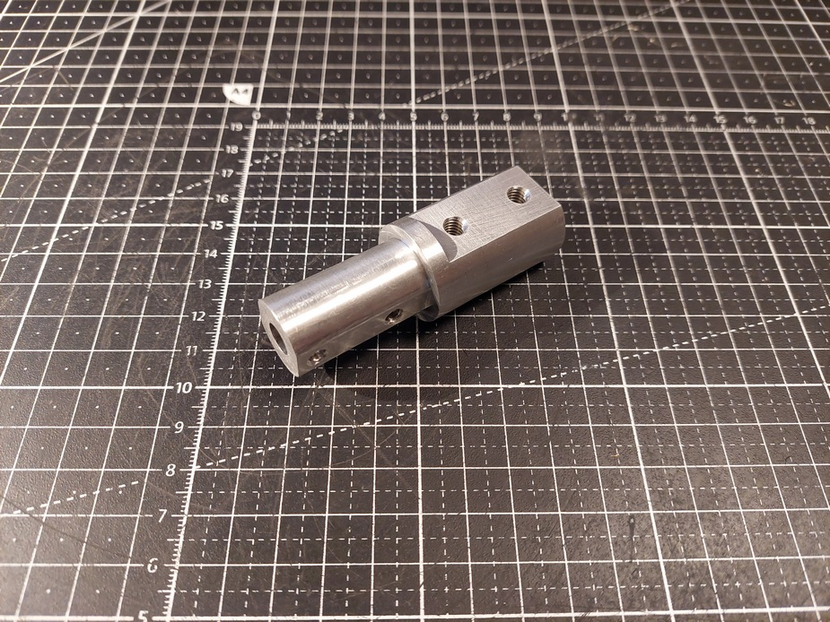
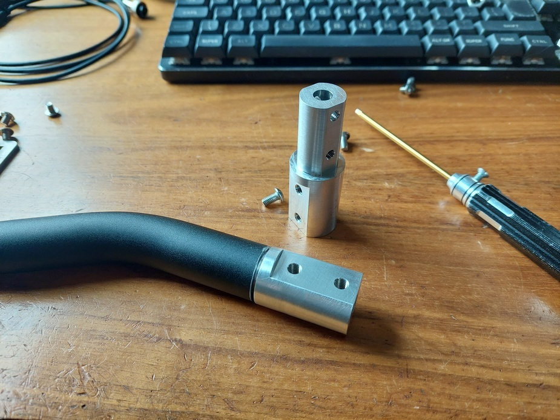
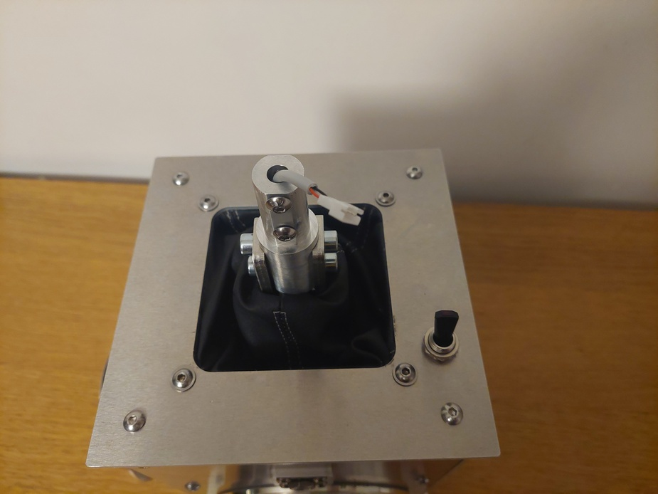
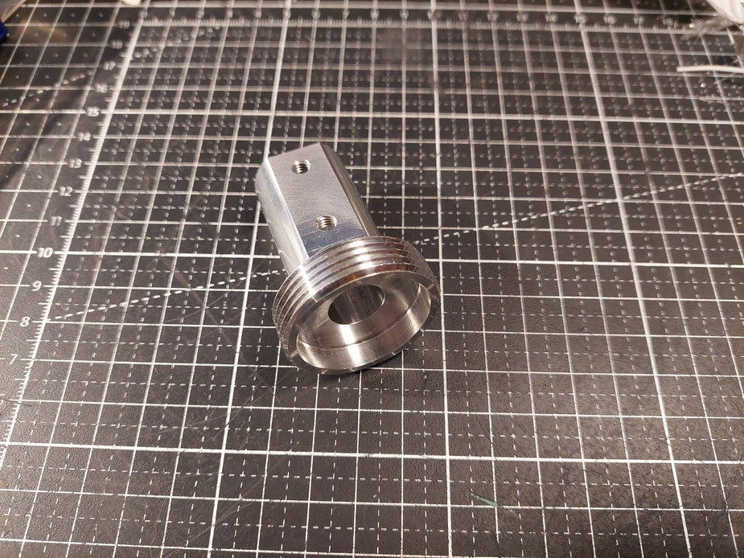
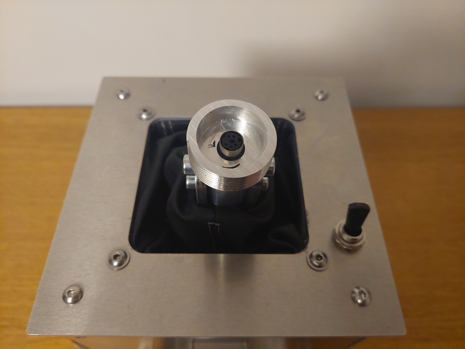
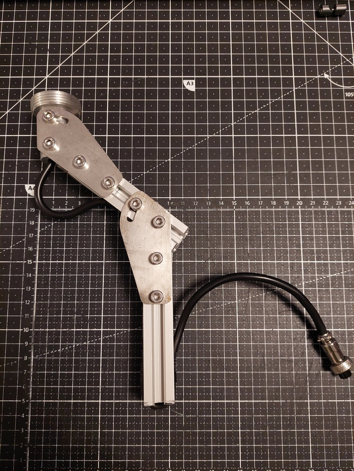

- TOC
{:toc}

---
For those who do not want to bother with searching places where to order metal parts and source other major parts separately I can propose a kits of them. 

{: .important }
>All parts are as they come from machining shop. You will need to deburr/sand them on your own if needed.

{: .important }
>Kit will include only parts on photo. You will need to obtain screws/nuts and electronic on your own according to the BOM.

{: .important }
> For availability of kits contact me directly via <a href="mailto:ffbeast.devices@gmail.com"><b>e-mail</b></a>. 

# Base metal set

{: .text-red-300 }
**Price for basic set is 249 Eur + Shipping**.

It includes basic set of metal/prints to assembly the base:
1. All needed bearings.
2. Pulleys and belts.
3. Gimbal parts.
4. Enclosure parts.
5. Covers for encoder for outside mounting.

# Adjustable extender kit

{: .text-red-300 }
**Price is 49 Eur + Shipping**

As the base for extender Alu profile 20x20mm was selected.
With a couple of sheet metal parts it makes good starting point for the extender of any length, and offset.

This kit allows to assembly adjustable extension that from bottom side will be connected to the gimbal,
and on top part will have either **interface for VKB MCG grip** or **Thrustmaster/VPC style interface**.

1. Alu profile  Need to be cut in half with proportion that suits your need in length and offset of extender (_optionally could be already pre cut ito 2 pieces of 100mm length_).
2. Brackets holding profiles together.

# Connection interfaces

In addition to the basic set there is an option of purchasing adapter interface:

## Interface for VKB MCG grip

{: .text-red-300 }
**Price is 49 Eur + Shipping**

3D printed of **stainless steel**. It is compatible with extender only and need to be mounted **directly to MCG grip**. Interface provides adjustable rotation angle 0-30 degrees.
Intended to be used with **adjustable extender**.

## VKB extended interface

{: .text-red-300 }
**Price is 29 Eur + Shipping**

Machined of **aluminium**. Allows to use native VKB extender by replacing lower part of it and **connecting it directly to the gimbal**. 

## Thrustmaster/VPC style interface

{: .text-red-300 }
**Price is 29 Eur + Shipping**

Machined of **aluminium**. Gives option to connect Thrustmaster style grips and extenders either **directly to the gimbal** or to the **adjustable extender**. 

