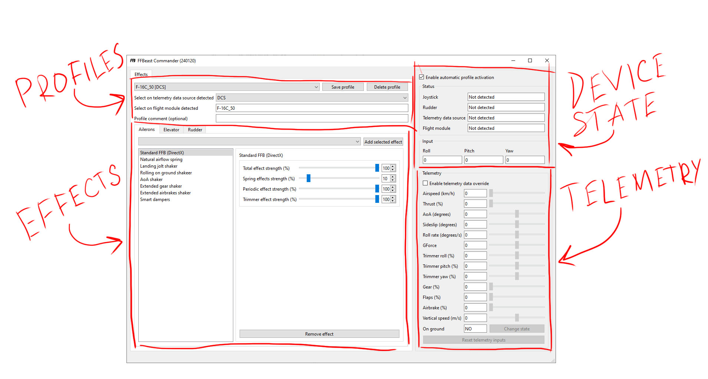
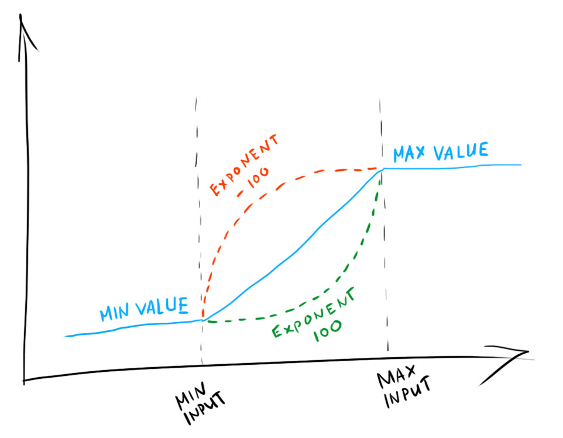
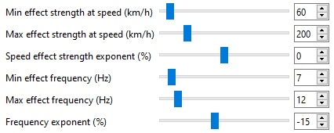
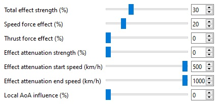
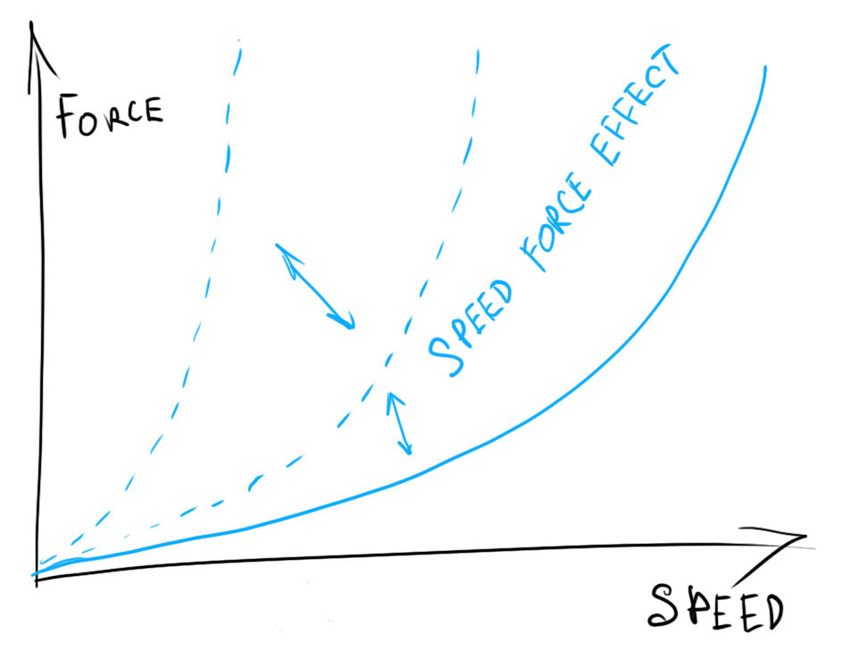
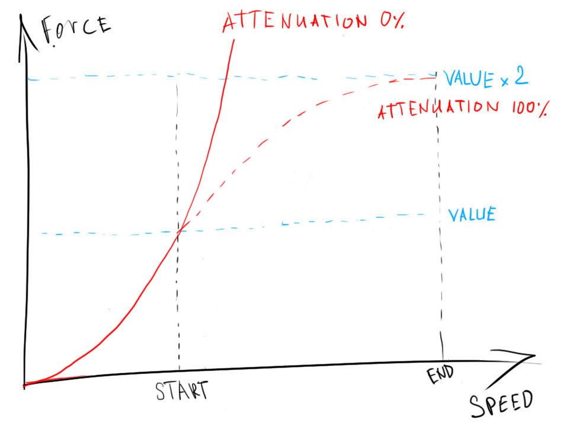
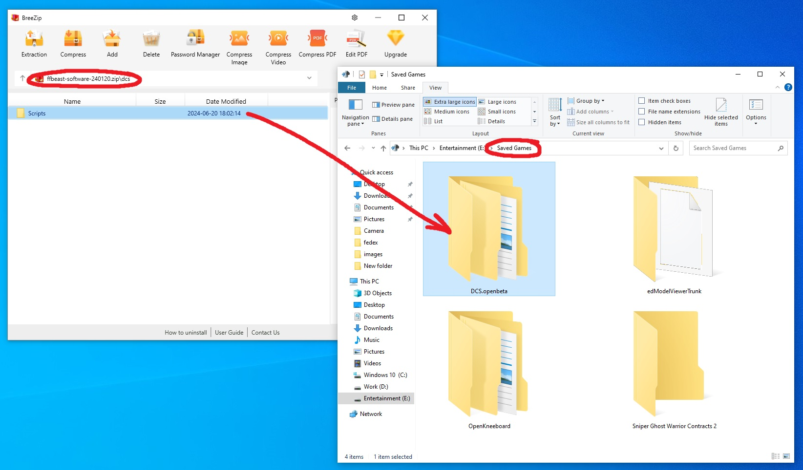

- TOC
{:toc}

---
# Generic functionality
Interface of program is divided in several sections representing logical parts of functionality.   

## Device state
It is part of the UI which outputs some helpful information

**Enable automatic profile activation** - Do what it says. If last selected profile is active no mater which game and flight module is detected 

**Joystick/Rudder connection states** - Shows if device is connected and version of firmware running on device

**Telemetry data source** - Shows game detected by software and providing telemetry

**Flight module** - Shows flight module name detected by software. Automatic profile switching is based on this name

**Yaw/Pitch/Roll** - Physical position of axis reported by device

## Profiles
Profile section allows to save effect profiles and then autoload them when game and flight module detected or select them manually.

In order to create a profile which can be automatically selected when flight module is detected:
- Select game from dropdown list.
- Input flight module name (just copy paste it from **Flight module** field when mission is running)
- Save profile.

Next time game will be running with that module and  **Enable automatic profile activation** checkbox is selected - profile will be activated automatically.

{: .important }
> **Important!**
> 
> Profile with same game selected, same flight module and same profile comment **will be overwritten** when saved.
> you can make several profiles for single flight module by alternating profile comment. 
> 
> **First profile in list matching criteria will be automatically selected when module detected.**

## Telemetry
This section has dual functionality. 

- Output generic telemetry data received by software. 
- Emulate telemetry data for effect testing purpose.

To start telemetry emulation just switch **Enable telemetry data override** checkbox and move sliders to desired values. 

{: .important }
> **Important!**
>
> Only common telemetry data is output there and can be emulated. Game/module specific data is not available for emulating!

## Effects editor
Effect editor allows to assign effects to individual axes. Only effects present in the list are active.
So each axis could have different set of effects and not cluttered with those that are not used for specific axis.

{: .warning }
> By default when **FFBeast Commander** is running it overrides default effects set in hardware.
> So **DirectX** effects and **Dampers** will not be active unless effect is not added to active effects list!

{: .important }
> All effects have **Total effect strength** parameter to control overall effect strength without need to adjust multiple parameters.
> Can be used for quick enable/disable effect without need to delete it from the active effects list.  

### Min - Max - Exponent concept
All effects depending on some variable parameter have concept of **Min-Max-Exponent** parametric curve.

For example lets take random shaking effect and analise its settings.

You should read it as following:
 - Before speed **60** strength of shaking is **0** 
 - Starting from speed **60** to speed **200** strength of shaking rises linearly(exponent is **0**) to its maximum strength
 - After speed **200** strength of shaking is fixed to maximum value
 - Before speed **60** frequency of shaking is **7Hz**
 - Starting from speed **60** to speed **200** frequency of shaking rises quickly(exponent is **-15**) to **12Hz**
 - After speed **200** frequency is fixed to **12Hz**

{: .important }
> Whenever you see in settings of effect those combination of **Min-Max-Exponent** parameters you can apply the principle described there for understanding it. 

### Standard FFB (DirectX)

Add this effect to enable native FFB effects provided by the game (if any). You can control individual components for the effects.

- **Spring effect strength** - strength of centering effects
- **Periodic effects strength** - strength of all kinds of shakers and vibrations
- **Trimmer effect strength** - strength of trim effect.

{: .important }
> **Hint!**
> 
> By setting spring to 0 and trimmer effect to 100 you can replace DirectX centering effects with custom centering 
> same time keeping trim effects natively provided by the game. 

### Simple spring

Does what it say. Just simple linear spring dependant on stick deflection

### Natural airflow spring

The main effect for all prop airplanes as it models variable stick load depending on speed of airplane and prop airflow.

- **Speed force effect** - reaction of force on speed change. With rise of speed force increases with square law.

 

- **Thrust force effect** - reaction of force on prop airflow. With increase of thrust force increases linearly.
- **Effect attenuation** - as with natural law forces rises quickly and could reach physical limit of the device
at low speed, effect attenuation added. It allows to change force law starting from some speed to be not a parabola
but smoothly reaching at **Attenuation end speed** the value x2 times higher than force at **Attenuation start speed**. 
 

### Elevator weight

Emulates elevator weight. Both stationary and dynamically with G force change.

### All kinds of shakers

### Smart dampers

# Game support 
## DCS
Archive contains folder named **"DCS"**. Copy contained in it **"Scripts"** folder to **"Saved Games/DCS<version>"**.
Restart DCS. Now **FFBeast Commander** will see telemetry from DCS when mission starts

## Il-2
## MSFS
## Condor 2
## War Thunder
