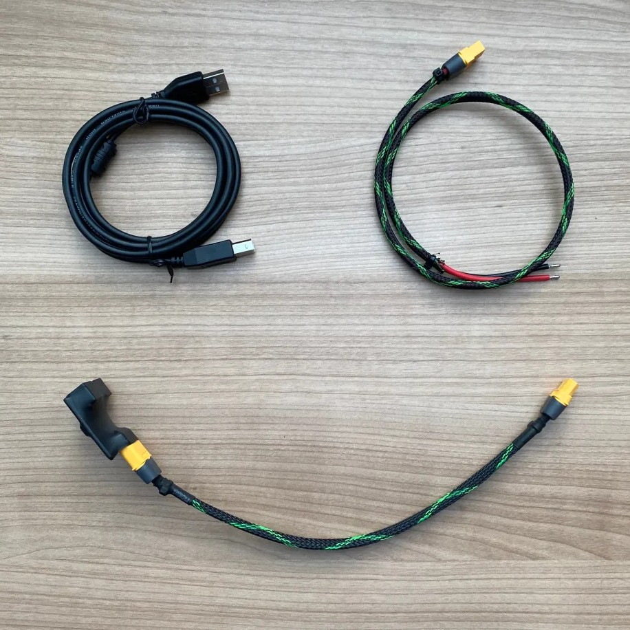
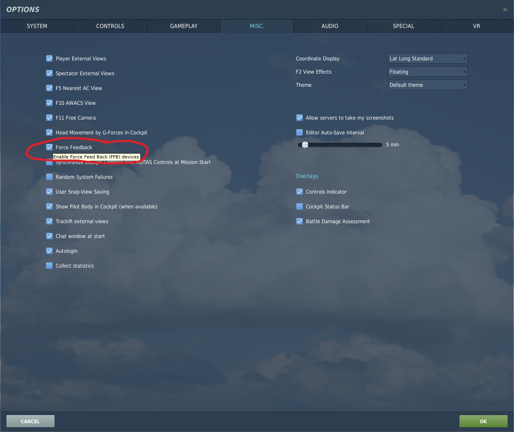
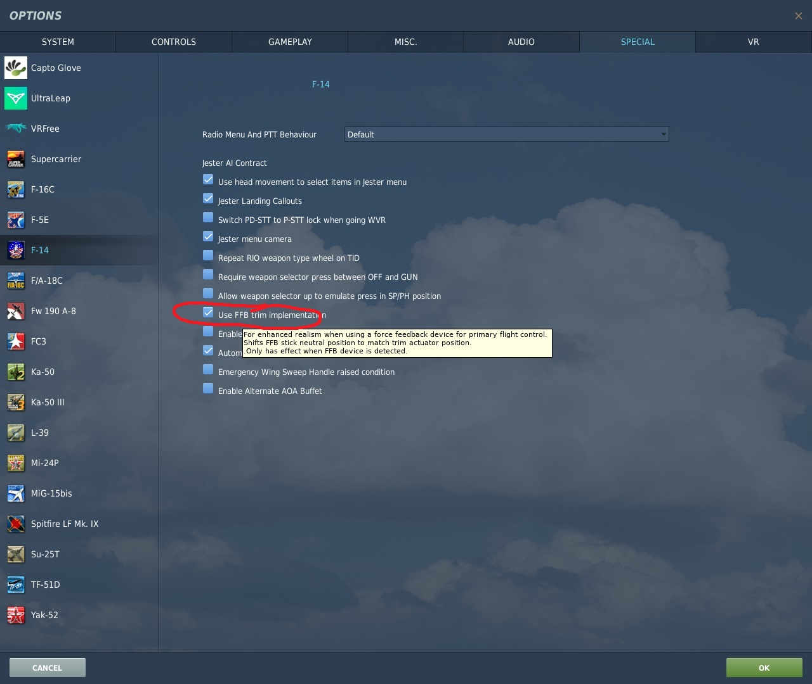
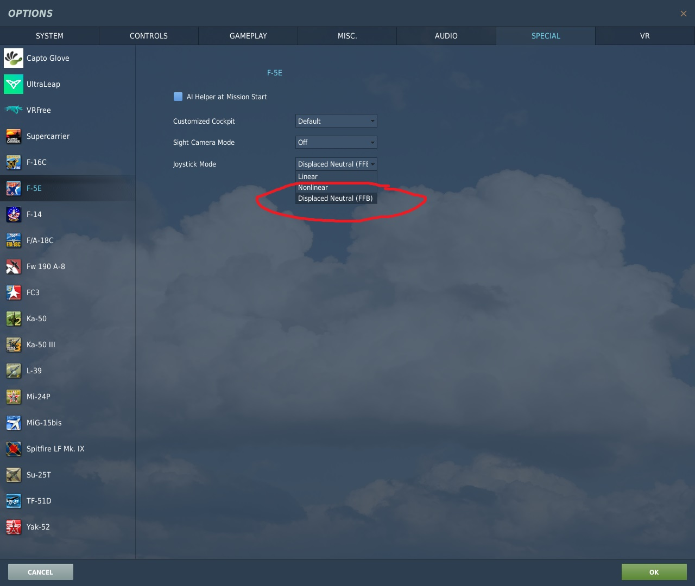
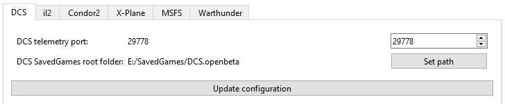

- TOC
{:toc}

---
## Intro

So you are lucky one and have received your device :) Out of the box joystick is setup for immediate use. 
When connected to PC via USB and power supply connected, devices is enumerated by Windows as a standard DirectX 
joystick with force feedback capabilities. All games that provide native DirectX FFB support can be played without
any additional setup. Mixed mode can be used when DirectX effects are mixed with effects generated from the game
telemetry by accompany software (FFBeast Commander).

## Switch

The base is equipped with toggle switch.

- **Down** position is **OFF**
- **Up** position is **ON**.

Turn it to the OFF before connecting anything

## Cables

All devices come with cables:

- USB
- 50cm cable XT60 to open ends for connecting modular PSU
- 25cs cable XT60 to XT60
- adapter for connecting [**two PSU in parallel**](hardware_PSU.html#pairing-psu-for-more-power)

### USB

Obviously plug one side to the device, other side to PC. Some users reported not stable behaviour on USB 3.0 ports. 
So it is recommended to use 2.0 port or USB HUB.

### PSU

You have several options there:
1. If you decided to use desktop PSU you will need to use adapter provided. 
You can either plug adapter directly to the base, or use extension cable. XT60 side comes to the base, PSU plugs into one of ports on adapter.
2. If you decided on modular PSU - use XT60 to open ends cable. IMPORTANT! - check polarity! Red is (+) and black is (-)

## Extender/Grip connection

Depending on you extension options, either connect grip to the base, or install extender. 

## Powering UP

- Check PSU is connected to the base and power line
- Check USB is connected
- Turn switch to **ON** position
- After turning on base will start calibration sequence. It perform it on EACH run. 
When starting calibration it need to have some space to move each side, so place stick in some position not on the end of the range. 
Better closer to the center before start.
- After calibration completed it will appear in windows as a gaming device.

## Software 

To utilize full potential of the device you will need to use [**accompany software**](downloads_flight_controls.html). 
Download the latest version and unzip it to some folder.

## Grip model setup

Device supports different grips:
- Thrustmaster F-16
- Thrustmaster F-18
- VPC FLNKR
- VPC Alpha
- VPC Alpha Prime
- VPC VFX
- VPC Mongoost
- VPC Mongoost CM2
- Tianhang F-18
- Custom grips based on shift registers

Because most of grips have different protocol you need to switch correct grip mode in software:

- Run  _**ffbeast-flight-controls-setup.exe**_ to access hardware setup functionality.
- Select device in dropdown.
- Navigate to the "**Periphery**" tab.
- Inside periphery tab navigate to "**SPI**" section
- Select you grip model from the dropdown.
- Press "**Save and reboot**" button.
- After restart device will be registering button presses on the grip.

## Game setup (DirectX FFB)

At this stage device is redy to be used as standard DirectX FFB joystick.
It can play native effects if game supports DirectX FFB protocol. 
At the moment list of games supporting native FFB is not big:

- DCS
- Condor 2
- il-2 Shturmovik (with nuances). there is a bug in implementation and Commander need to be run in background)
- Warthunder (with nuances). there is a bug in implementation and Commander need to be run in background)

**Nuances**. some games have bugs in implementation of FFB. Those bugs are compensated in FFBeast but Commander need to be 
running in background to determine which game is running and make correct bug compensations.

### DCS

In DCS you need to activate FFB support first. It is needed for native FFB output. 

In addition you need to visit special settings for flight modules that you have and activate ffb functionality for them (if any present). Here are some examples:

### Condor 2
Just assign pitch and roll axes. No additional setup needed.

### il-2 Shturmovik
WIP

### Warthunder
WIP

## Game setup (Telemetry augmentation)

The most interesting comes there. As native FFB either not supported by some games or have bugs in implementation
augmentation mode was introduced. To use it you need FFBeast Commander to be running in background when you play
the game. Full list of games supported in augmentation mode:

- DCS
- il-2 Shturmovik
- MSFS
- X-Plane
- Warthunder
- Condor 2

You can check [**full documentation**](ffbeast_commander.html) later. For now you need to be aware of some points:

- Commander need to be running. To start using it just run _**ffbeast-commander.exe**_
- Telemetry need to be setup for game (if any setup needed).
- Game need to be running and translating telemetry.
- Proper telemetry mode need to be selected in [**telemetry section**](ffbeast_commander_telemetry.html).
- Some effects need to be present in the list of [**active effects**](ffbeast_commander_effects.html#active-effects-list).

### DCS
In Commander navigate to "**Game Config > DCS**" tab.

- set port on which Commander will be communicating with DCS. It could be any free port in the system. 
Usually ports closer to 30000 are fre so pick random number around it.
- set path to saved games DCS folder. Commander will install lua script there so DCS can export telemetry. 
- Press "**Update configuration**" and restart Commander.
- Start DCS, start DCS mission and check that flight data is showing in telemetry status section.

### il-2 Shturmovik
WIP

### MSFS
WIP

### X-Plane
WIP

### Warthunder
WIP

### Condor
WIP

## Profiles
Some effect profiles are available in [**download section**](downloads_effect_profiles.html).
You can use them as is or modify to your likings by [**editing active effects**](ffbeast_commander_effects.html). 