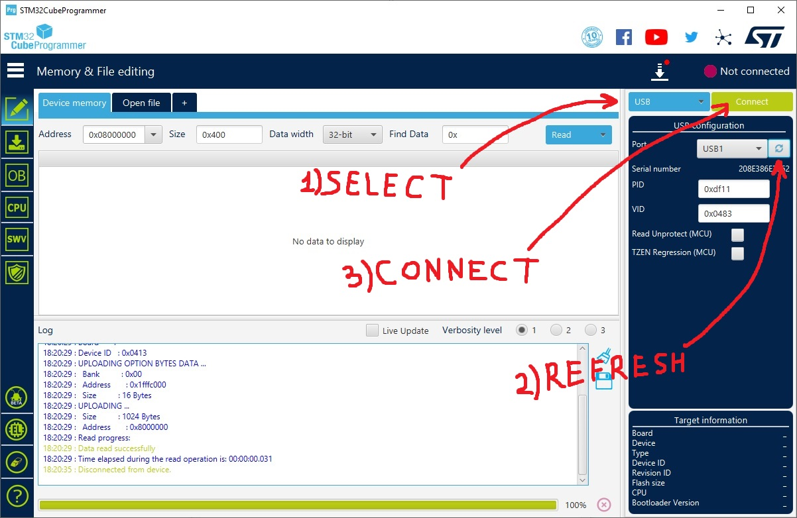
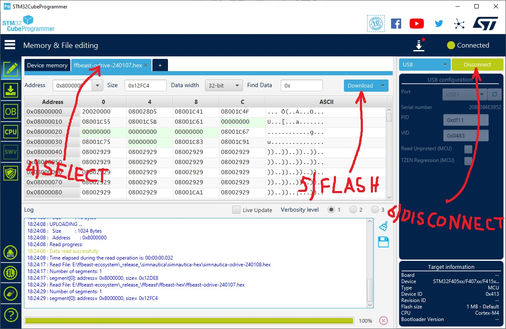

- TOC
{:toc}

---
## STM32CubeProgrammer 
To flash FFBeast firmware to controller you need to use 
[**STM32CubeProgrammer**](https://www.st.com/en/development-tools/stm32cubeprog.html#get-software).
This is a specialized utility designed for flashing STM32 controllers. 
Simply download it from the official site and proceed with the installation.

## External power

{: .important }
> ODrive boards do not power up from USB! 
> 
> **Connect external power source to boot the controller!**

## DFU
All STM32 controllers support firmware flashing in DFU (Device Firmware Upgrade) mode directly via a USB cable. 
Many boards are equipped with a physical switch that enables booting in DFU state. Here are some examples.

### ODrive

Usually it have micro switch. So process of booting in DFU mode will be following:

- Connect board to PC via USB cable.
- Disconnect external power from the board.
- Turn micro switch to DFU position.
- Connect external power - controller will boot in DFU mode.
- [Flash firmware](https://ffbeast.github.io/docs/en/common_firmware.html#flashing-process).
- Disconnect external power.
- Turn micro switch to original position.
- Connect external power - controller will boot in normal mode.

### MKS XDrive

This boards have jumper on it. So process of booting in DFU mode will be following:

- Connect board to PC via USB cable.
- Disconnect external power from the board.
- Remove DFU jumper.
- Connect external power - controller will boot in DFU mode.
- [Flash firmware](https://ffbeast.github.io/docs/en/common_firmware.html#flashing-process).
- Disconnect external power.
- Install DFU jumper.
- Connect external power - controller will boot in normal mode.

### ODESC 4.2

This boards do not have dedicated switch or jumper but have special button:

- Connect board to PC via USB cable.
- Connect external power. Controller will boot in normal mode.
- Press and hold **BOOT** button.
- Press **RESET** button - controller will reboot in DFU mode.
- [Flash firmware](https://ffbeast.github.io/docs/en/common_firmware.html#flashing-process).
- Press **RESET** button - controller will boot in normal mode.
 
## ST-LINK
Unfortunately not all boards available on market have physical DFU mode switch. In case it is missing on your board
you will need to use ST-LINK to flash firmware to the controller. This procedure requires an STLink/V2 or compatible programmer.

To use ST-LINK follow the procedure:
- Wire ST-LINK to ODrive board. You need GND, SWD, SWC and NRST pins connected. 
- Connect ST-LINK to PC via USB cable.
- Connect external power to controller. It will be ready for flashing.
- [Flash firmware](https://ffbeast.github.io/docs/en/common_firmware.html#flashing-process).
- Disconnect external power.
- Disconnect ST-LINK.
- Connect external power - controller will boot in normal mode. 

{: .important }
> Unfortunately, not all ST-LINK devices will work reliably. 
> There have been numerous reports and discussions indicating that cheaper ST-LINK clones 
> may have stability issues and unreliable communication with STM32 controllers. To mitigate this, if possible, 
> consider purchasing a controller with the option to enable 
> DFU mode physically or obtain an ST-LINK from a trusted source.

## Flashing process
Firmware fleshing process is pretty simple. Just use one of methods described above and follow steps:

1. Select method (USB for DFU, ST-LINK for ST-LINK).
2. Press "Refresh" button to see connected controller or ST-Link.
3. Press "Connect"
4. Select **HEX** file that you want to upload
5. Press "Download" to start flashing process.
6. When process finishes - just "Disconnect"

Flashing completed!

{: .important }
> I trust you're already aware of the basics, such as ensuring a stable power supply and keeping 
> all connections intact during the flashing process. Happy flashing!

