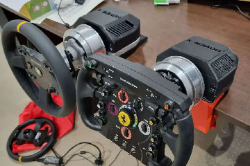
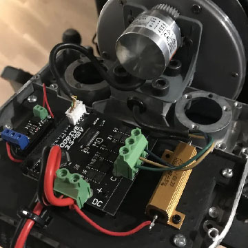
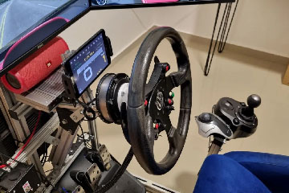
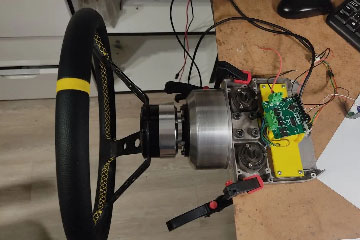
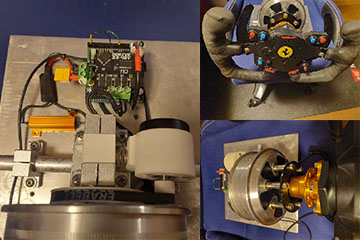

## Intro

This site is all about **DIY Direct Drive FFB Wheel project** based on **ODrive/ODESC** controller boards and **BLDC** motors. 
The purpose of this project to build high torque DD wheel comparable to the branded alternatives on a budget. 
When carefully selecting parts, with help of this site you will be able to build **the cheapest DD wheel possible**,
yet way more powerful(**up to 15Nm** with good howerboard motor) then entry level branded DD alternatives.

For the start - check all pages! There is a lot of information already. If you found your questions not answered yet - 
fill free to ask them in [**Discord**](https://discord.gg/Gt6rnvrZKu)!

### Some example builds made by community members:

