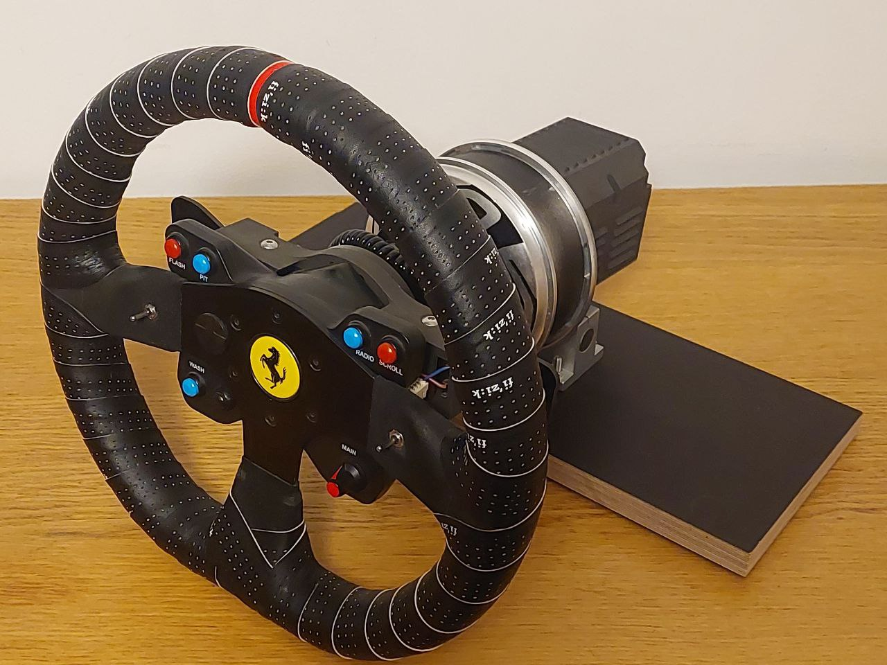
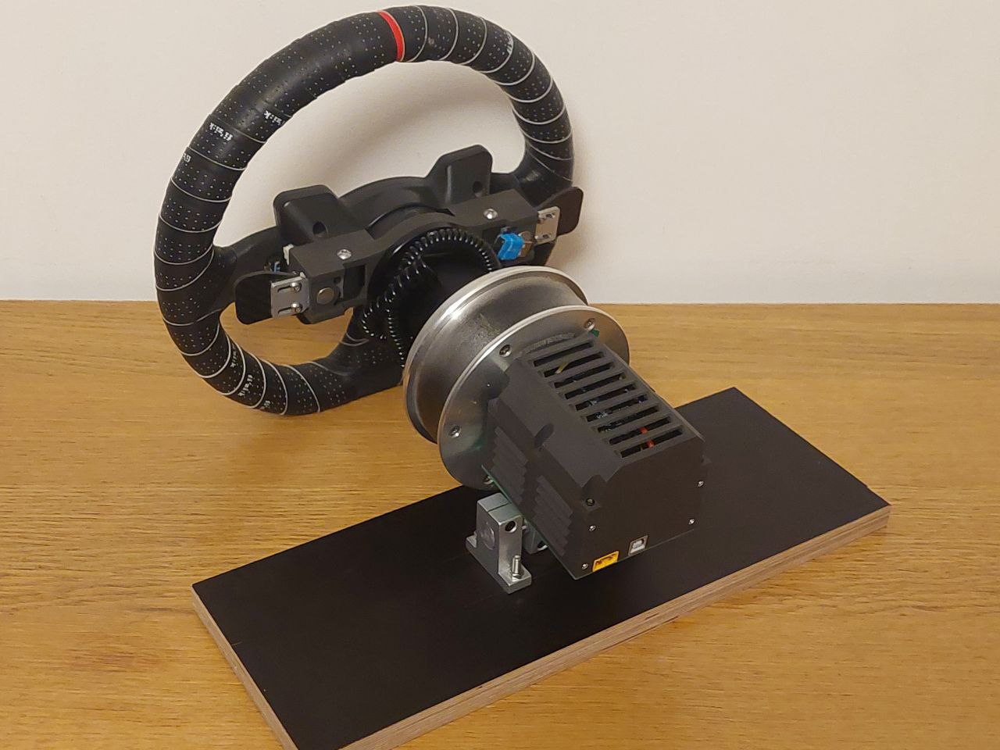
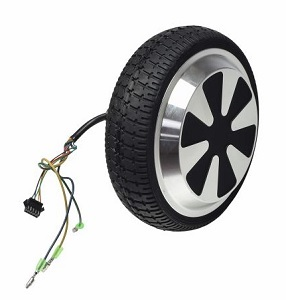
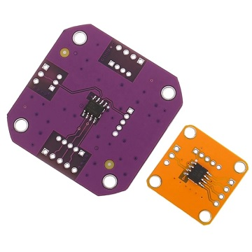
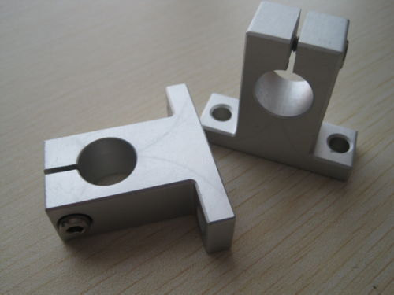
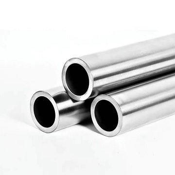

- TOC
{:toc}

---

{: .warning }
> **THIS PAGE COVERS THE VARIANT OF ASSEMBLY SHOWN ON THE PICTURES BELOW!** 
>
>It is only **ONE OF MANY** possible ways how to build DD base. 
If you find this variant too expensive or complicated, feel free to visit the [**FFBeast Discord**](https://discord.gg/Gt6rnvrZKu) for inspiration. 
There, you will find discussions on multiple other technical solutions for each step, 
possibly discovering alternatives that are easier to implement.

## All in one video guide

<iframe width="360" height="360" src="https://www.youtube.com/embed/hTGs8kaHYR8?si=Nw8zB0GpSAG7B3fK" title="YouTube video player" frameborder="0" allow="accelerometer; autoplay; clipboard-write; encrypted-media; gyroscope; picture-in-picture; web-share" allowfullscreen></iframe>
## Assembly details

### BOM

| Part                   | Quantity | Total (USD)   |
|------------------------|----------|---------------|
| MKS XDrive single axis | 1        | 45 to 50      |
| Howerboard motor       | 1        | 10 to 30      |
| Encoder (MT6701)       | 1        | 2 to 3        |
| SK16                   | 6        | 10 to 15      |
| 16mm shaft(150mm)      | 1        | 3 to 5        |
| 3D printed enclosure   | 1        | 10 to 30      |
| Breakout PCB           | 1        | 2 to 3        |
| AMASS XT60             | 1        | 1 to 2        |
| USB connector          | 1        | 1 to 2        |
| Wheel attachment       | 1        | 10 to 15      |
| Screws/Nuts/Wires      | N/A      | 3 to 5        |
| **Total**              |          | **85 to 160** |

{: .warning }
> **THE BOM COVERS THE BASE ONLY!**
> 
> The BOM does not include PSU and Wheel and question of choosing them is out of scope for this chapter.  

### Controller

I've selected **MKS XDrive** just because it has good square shape, square pattern of mounting holes, 
and comes in a bundle with the braking resistor and wires. 

{: .important }
> For other options check the page with [**supported controllers**](common_controller.html) 

### Motor

Obviously - 6.5 inch howerboard motor. Cheap and powerfull. 

{: .important }
> Why? You will find the answer in the chapter about [**supported motors**](common_motor.html)

### Encoder

MT6701. Just the cheapest option for the purpose of the cheapest build!

{: .important }
> Alternative [**encoders**](common_encoder.html) available and can be used.

### Mount
Six of SK16 and single 16mm diameter shaft...

...are enough to build robust, stiff and adjustable mount!

{: .important }
>Search by keywords "linear shaft holder", "linear shaft", "hollow linear shaft" on Aliexpress. 100mm or 150mm length will do the job.  

### Breakout PCB

[Publicly available on Easyeda](https://u.easyeda.com/olukelo/ffb-breakout).
JLCPCB.COM will make it for you as cheap as 2$ for 5 pcs. It helps to arrange everything and make a "clean" build because was designed to perfectly couple enclosure with mounting hardware.

### Wheel attachment

As I do not need to swap the wheel - solid one works for me. In case you need swap wheels - just select quick release.

{: .important }
> Searching for "Steering Wheel Hub Spacer" and "Steering Wheel Quick Release" on Aliexpress gives plenty of good results.

### Enclosure
Designed specifically for **MKS XDrive** and **MT6701**. For other options need some mixing and matching.

{: .important }
> [**Check the link**](https://cults3d.com/en/3d-model/game/howerboard-dd-ffb-wheel-enclosure) with STL files ready to be printed, and full STEP project in case you would like to modify it for your need.  

<iframe src="https://gmail2239807.autodesk360.com/shares/public/SH512d4QTec90decfa6e83c81846a2160a14?mode=embed" width="736" height="736" allowfullscreen="true" webkitallowfullscreen="true" mozallowfullscreen="true"  frameborder="0"></iframe>

