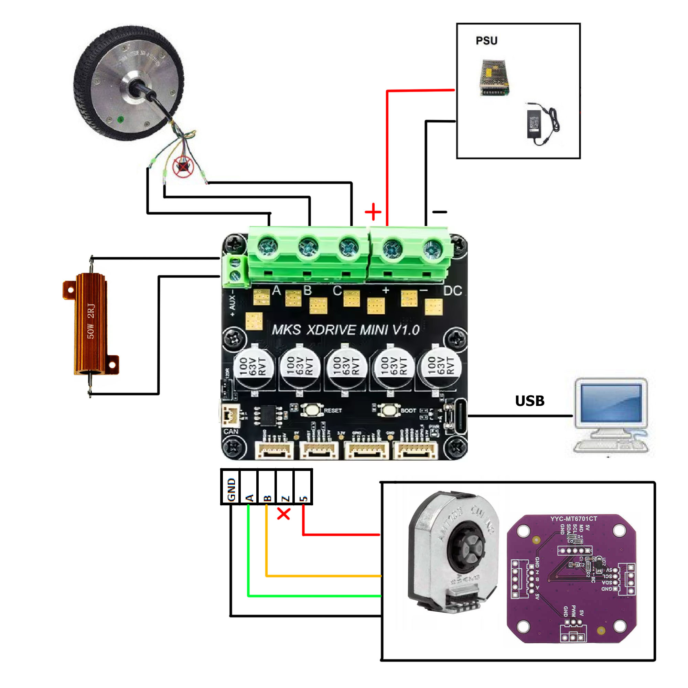
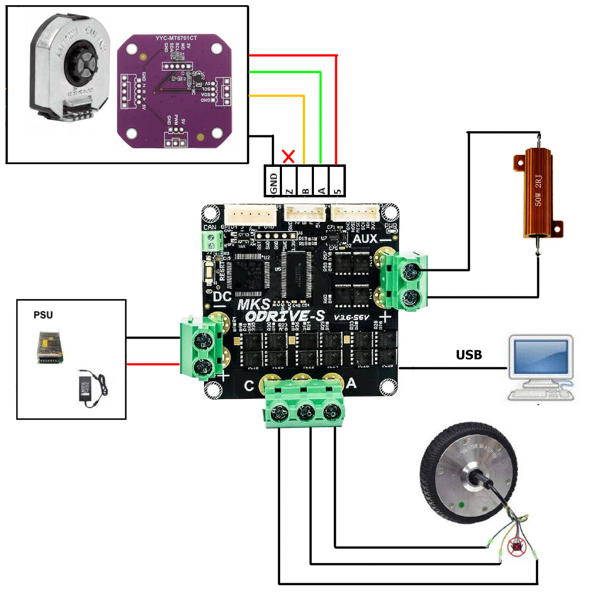

- TOC
{:toc}

---

## Warning!
{: .warning }
> **NEWER, EVER, TRUST WIRE COLOR CODING!**
> 
> Check name of the pin or wire coming from encoder and **ALWAYS** connect by the name, not by the color of the wire. 
> There is no standard wiring color coding and each manufacturer can change the color of the wire without any notice.
> Match connections **BY THE NAME!**

# Required connections

## ODESC 4.2

## MKS XDRIVE MINI

## MKS XDRIVE-S

