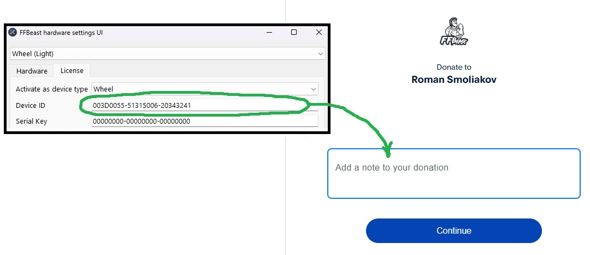

You can say your "thanks" there by donating on project development. 
It will let me know, that the project is helpfull and motivate me to develop it further.

 

<form action="https://www.paypal.com/donate" method="post" target="_top">
<input type="hidden" name="hosted_button_id" value="GR92HWM7X277Q" />
<input type="image" src="https://www.paypalobjects.com/en_US/PL/i/btn/btn_donateCC_LG.gif" border="0" name="submit" title="PayPal - The safer, easier way to pay online!" alt="Donate with PayPal button" />

</form>

In case of providing **Device ID** each donation will be rewarded with small gift in form of **Serial Key** for **unlocking extended functionality**.
Extended functionality is not critical for building a wheel, it just gives possibility to change some extra non critical settings
and connect additional buttons/axis directly to ODrive.

{: .important }
>**Standard version is fully functional. You can use it without a key!**

