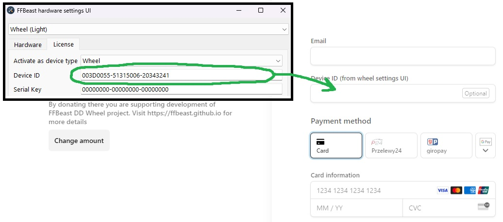

You can say your "thanks" there by donating on project development. 
It will let me know, that the project is helpfull and motivate me to develop it further.
In case of providing Device ID each donation will be rewarded with small gift in form of unlocking extended functionality.
This functionality is not critical for building a wheel, but will give possibility to change some extra settings 
and connect additional buttons/axis to ODrive. Chears!

  

    <stripe-buy-button
            buy-button-id="buy_btn_1Oh9GlAUMJA5adUcWabNoRx2"
            publishable-key="pk_live_51N3FsMAUMJA5adUcbQwaE8tIDLRbB2bW94T4SqdYEUYhwdWbFbXKoHiOzETl6WpBpZRtQtBqq701Ug5q8gA1CVn500WyNLoWsx"
    >
    </stripe-buy-button>
  

