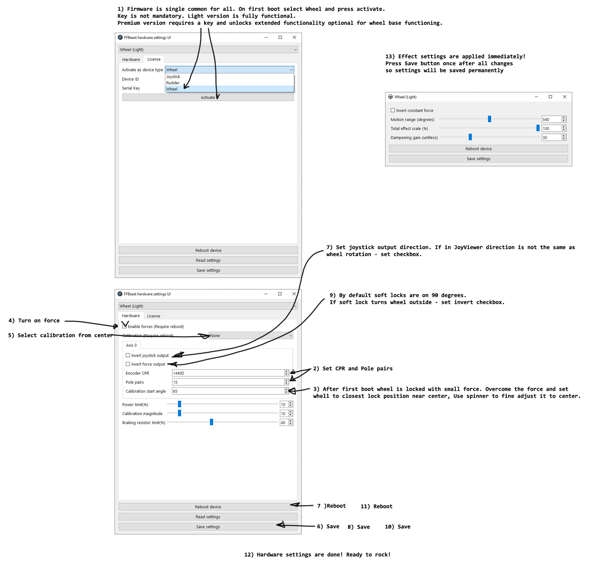

- TOC
{:toc}

---

## Firmware download
[**Download**](downloads.html) the latest software/firmware pack.
Or any of previous versions if you have some preferences.
It contains all files needed to setup hardware and change settings of it. 
Unpack it to the place where you will be running it. 

## Firmware flashing

Just follow [**firmware flashing process**](software_firmware_flashing.html). Use HEX found in the archive.
 
## Settings quick start

When firmware flashing is done, reboot controller and run **ffbeast-hardware-settings-ui.exe** 
app sitting in **ffbeast-ui** folder.

### Device mode
By default device boots as generic device which could be switched to different device mode. To use it as the FFB Wheel 
go to **"License"** tab, select **"Wheel"** and activate device. 
Now device will be in the FFB Wheel mode each time you reboot it.  

### Hardware setup
As the next step you need to input required hardware values: **Encoder CPR** and **Pole pairs**. 
Consult datasheets for your components to found those values.

{: .important }
> In case you follow [reference assembly](wheel_assembly.html) and use [MT6701 encoder](hardware_encoder.html) put 4096 into **Encoder CPR** 

{: .important }
> In case yof using [howerboard motor](hardware_motor.html) put 15 into **Pole pairs**

### Center position setup  
 By default when performing start calibration sequence motor is pulled to close magnetic pole position and consider this position as the center.
 