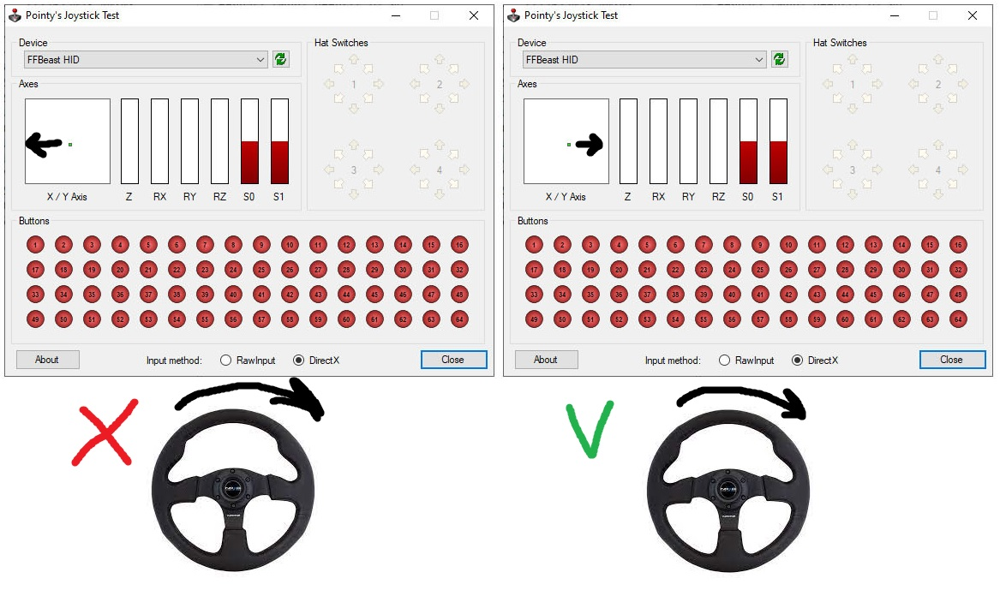

- TOC
{:toc}

---

## Firmware download
[**Download**](downloads.html) the latest software/firmware pack.
Or any of previous versions if you have some preferences.
It contains all files needed to setup hardware and change settings of it. 
Unpack it to the place where you will be running it. 

## Firmware flashing

Just follow [**firmware flashing process**](software_firmware_flashing.html). Use HEX found in **ffbeast-hex** folder.
 
## Settings quick start

When firmware flashing is done, reboot controller and run **ffbeast-hardware-settings-ui.exe** 
app sitting in **ffbeast-ui** folder.

### Device mode
By default device boots as generic device which could be switched to different device mode. To use it as the FFB Wheel 
go to **License** tab, select **Wheel** and activate device. 
Now device will be in the FFB Wheel mode each time you reboot it.  

{: .important }
> **You can activate wheel without a key!** Just leave **Serial Key** field "as is" and press **Activate**. 
> ****
> **Standard version if fully functional and have all essential functionality needed to build the wheel.**  

{: .important }
> **Extended version** of software is available as reward for [**project contributors**](wheel_contribute.html). 
> 
> It gives possibility to change some additional non critical settings, and possibility to connect buttons/axis directly to ODrive.

### Hardware setup
As the next step you need to input required hardware values: **Encoder CPR** and **Pole pairs**. 
Consult datasheets for your components to found those values.

{: .important }
> In case you follow [reference assembly](wheel_assembly.html) and use [MT6701 encoder](hardware_encoder.html) put 4096 into **Encoder CPR** 

{: .important }
> In case yof using [howerboard motor](hardware_motor.html) put 15 into **Pole pairs**

### Center position setup  
 By default when performing start calibration sequence motor is pulled to the closest 
 magnetic pole position and consider this position as the center. 
 You can change center position manipulating **Calibration start angle**.
 - Make sure **Enable force** checkbox is **UNCHECKED** 
 - Make sure **Calibration** set as **NONE**.
 - Overcome force of magnetic pole and put your wheel into  "locking" position closest to the center. 
 - Manipulate **Calibration start angle** so wheel moved to the center position precisely.

This position will be saved as the center in future.

### Activate force
When essential settings are set wheel ready to be activated
- Check **Enable force** checkbox.
- Select **Calibration** mode **Start as the center**.
- Save settings to the controller.
- And as final step **Reboot** device.

### Output setup
To make life easier, direction of joystick input should follow direction of the wheel rotation. 
[**JoyTester**](downloads.html) will help us do the job. Check if marker in joy viewer goes to the same direction where wheel rotates. 
If it goes in opposite direction - check **Invert joystick output** option and **Save settings to controller**.  

### Force direction
As the next step wee need to setup the wheel so forces work in correct direction.
You can use [**ForceTest**](downloads.html) program to check the forces. 
Turn on **Spring center** effect and check if force pulls the wheel to the center. If force pulls wheel off center - check
**Invert force output** option and **Save settings to controller**.  

### Personalization
All remaining settings could be set to your likings. Set desired Motion range, Dampening, and Power limit.

## Braking limit setup
The last point in settings is braking limit. Setup of it requires a bit of trial and errors. 
During the quick rotations motor works as a generator.
It produces electric energy and thus increases voltage in power line. 
It can cause PSU to go into overvoltage protection mode and switch off.
To negate this effect, we connect a braking resistor to the ODrive in order to dissipate part of energy through it.
How much - is determined by **Braking limit** setting. What is correct value? **Depends on your motor and PSU**! 
The best approach is to start from smaller value(5-10) and try to play. 
If during quick rotations left-right PSU keep working - it's done. If no - increase it by 5-10 percents and repeat.

## Enjoy!
That's all. You've gone through all needed settings and your DIY Wheel is ready to go! 
If you like the journey - feel free to [**donate on further project development**](wheel_contribute.md).
Your thanks will be much appreciated :) 