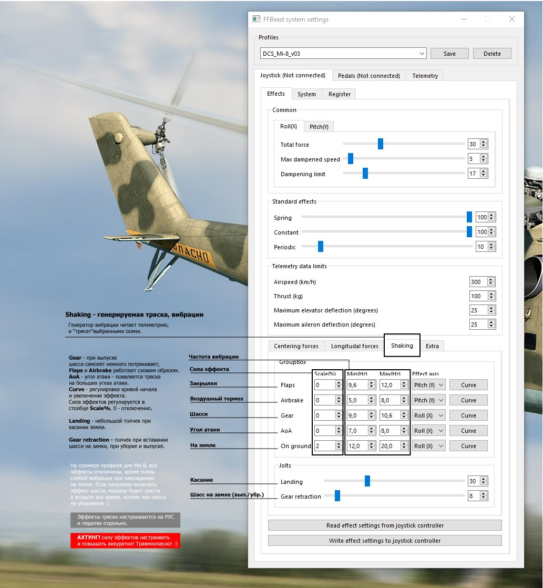

# FAQ RUS

### Помогает ли данная реализация FFB в управлении самолётом. Особенно интересует воздушный бой. Например, можно ли по силе по ручке определить перегрузки, угол атаки при маневрах. 

* Точность стрельбы и контроль самолёта улучшается.
* Тактильно понимаешь по загрузке что начинаешь перетягивать.Ффб приучает к дисциплине. Если на Р-51 на обычном джойстике хотелось попытать счастье в горизонтальном бою.То ффб тебя как бы просто заставляет бросить эту затею и перейти к “бум-зуму” скорость-энергия.
* Например один и новых пользователей ФФБ, в первый вылет на ФФБ размотал двоих в звене. Хотя догфайтер не сильный.
* Результативность в боях стала лучше (в тундре летаю) осмысленности в действиях прибавилось, в разы выживаемость повысилась

### Девайс больше для получения удовольствия и погружения. Есть практическая помощь в ощущении самолёта. 
* На ффб получите удовольствие и в DCS и в Тундре и в Il-2
* В Ил-2 сила вибрации в начале манёвра посказывает о перетяге ручки. С падением скорости вибрация уменьшается,тем самым даёт понять что тянуть рус не надо.

### Как FFB ведёт себя в активном догфайте, когда приходится довольно активно двигать ручкой? Выдерживает такой режим?

Да все как на обычном джойстике. Только на ффб можно менять нагрузку в софте. Например для виражника и или бум-зумера. Ффб помогает контролировать скорость.
По оси направления раскачка носа отсутствует.

### В вертолётах этот девайс работает?

* В будущей обновлении софта (на сентябрь 2023)  будет триммирование педалей, как на МИ-8. А сейчас на ветролетах летается прекрасно, все триммируется и управляется почти как в реале, так как реализовано в ДКС. Никаких возвратов ручки в центр, никаких костылей и борьбы с пружиной.
* В Ми-8 совсем прелесть. Немного подшаманить загрузки, и будет почти как на тренажёре.

### Из последнего стрима о FFB, я понял что девайс полностью раскрывается только в DCS. Или в ил2 тоже будет помогать "рулить"?

* Без ффб я смотрел на инверсию на крыле,как сильно я теряю скорость в манёвре. А на самолетах управление кайф, никакой раскачки по тангажу верх-вниз, самолеты прям чувствуются, летается более гладко, никаких дерганий. Летать становится легче, да, самолет летит сам, просто его подправляешь и направляешь
* В ИЛ-2 ровно так же помогает. Только самолёт "другой".  Если в ДКС Р-51 похож на настоящий (поверим Максу), то в иле он отличается от дэкаэсного. А вот то что срываться в штопор перестал в догфайте,  это заслуга ффб.

### В ДКС на стоянке при выключенном моторе РУС мелко мелко дрожит. На больших скоростях если большое скольжение (шарик сильно в стороне) педали начинают сильно вибрировать с малой амплитудой и большой частотой. При даче педали и приведение ширик в центр, вибрация пропадает. Эти два дрожжания можно как нить  убрать?

Дрожание на земле настраивается, дрожание на больших углах атаки тож.

### Могут кнопки одрайва возбуждаться, или дребезг иметь? Какая проблема у меня? Назначил кнопку стрельба из пушки.  На стоянке при заведенном двигле был самопроизвольный выстрел. Подумал что надавил случайно. Хотя кнопка туго прожимается. Далее произошло в полёте. Тоже выстрел. Причем очередью, хотя на кнопку не жал.  При назначении клавишь, частенько перепрыгавало на строку "стрельба из пушки". Хотя джой даже не трогал. В полете когда была сделана стрельба, обратил внимание что на экране гашетка пушки мелко-мелко дрожжит. Когда нажимаешь кнопку, она на экране четко прожимается и идет нормальная стрельба.

Кнопки на одрайве как раз и дрожат, надо замкнуть два контакта на плате через сопротивление, подробнее Виктор может рассказать, последние джойстики у него идут уже с этой перемычкой.

### Если у меня ручка ВКБ подключена к блэкбокс, нужно обязательно замыкать пин GPIO 8 на GND (землю)?

Да, надо замкнуть, а то в контролере одрайва кнопки как гирлянда мигают

