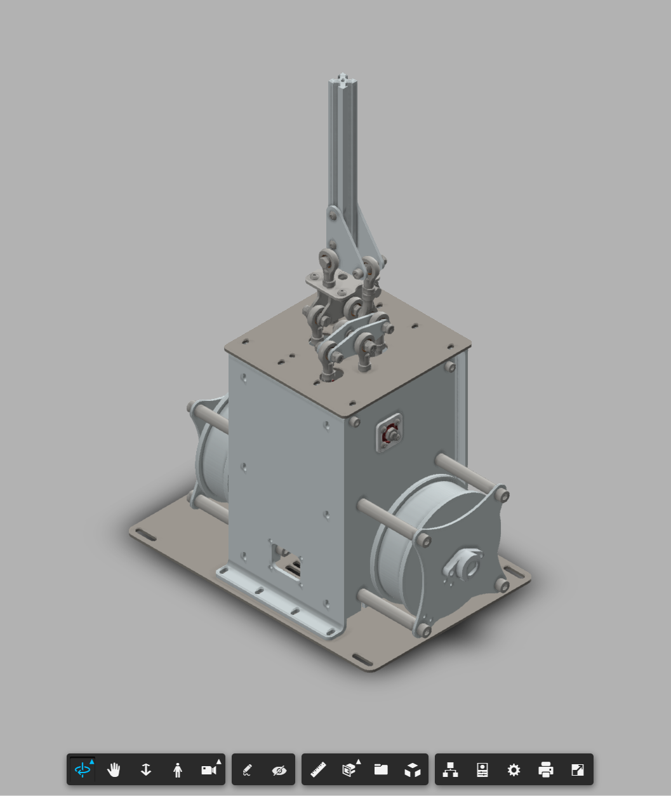
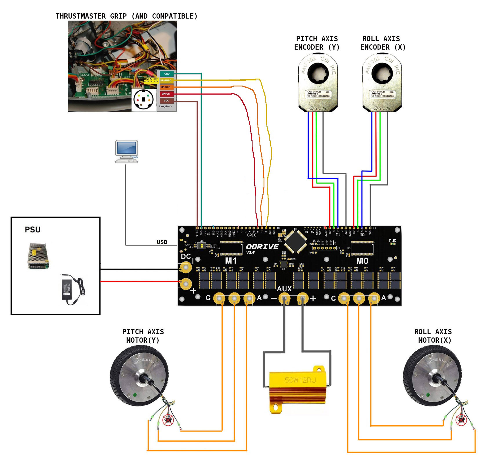

# Энкодеры.
{: .no_toc }

## Содержание
{: .no_toc .text-delta }

- TOC
{:toc}

---

## CAD

По [**ссылке**](https://a360.co/3FeNV4K) находиться превью проекта в Fusion360. Для этой версии доступны [**чертежи**](../../assets/cad/joystick_cad.zip) по которым можно собрать собственное устройство. В архиве есть как сборка в формате STEP так и файлы готовые под порезку.

### Подключение
Схема подключения довольно простая и не требует глубоких познаний в электронике:

### ПО

Состоит из прошивки, программы компаньена для Windows и дополнительных скриптов экспорта для DCS. В виду постоянных изменений даной части просьюа обращаться по поводу ПО в [**Discord**](https://discord.gg/Gt6rnvrZKu).

### P.S.

По мере стабилизации ПО и других аспектов данного продукта более подробные инструкции и документация будут добавляться.