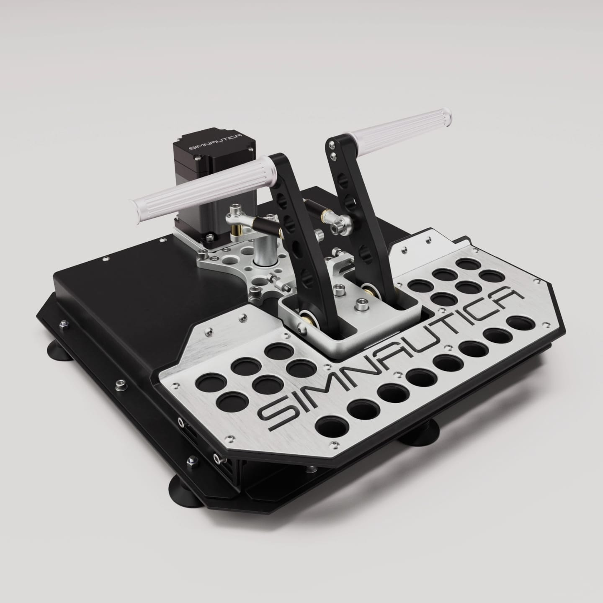
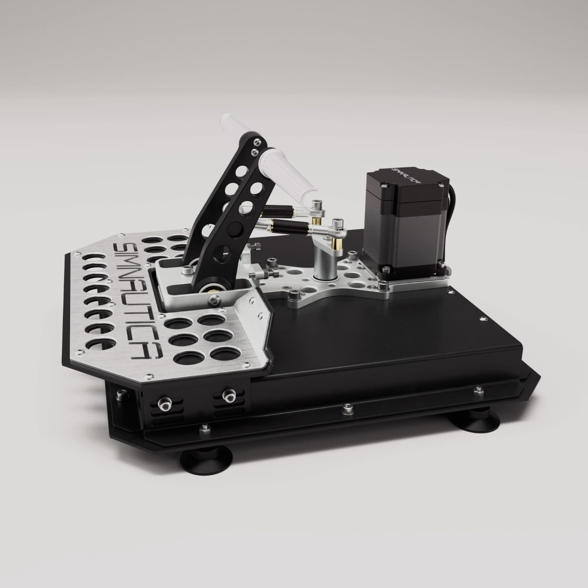

- TOC
{:toc}

---

## Welcome stranger! 

The fact that you've landed here suggests you may have caught wind of the 
**Force Feedback Flight Controls** or **DIY FFB Wheel** and are now looking for additional insights.
You are in a right place!

## [FFBeast Active Flight Controls](docs/en/joystick.html)

For those dedicated to the art of flight simulation and  demand authenticity in their virtual cockpit,
**FFBeast Flight Controls** are designed with single goal in mind:
to fill a gap between simulation and true aviation experience. Crafted with an all-metal construction,
powered by high torque motors and accompanied by custom effects software, this joystick is a testament 
to durability, precision and immersion.

**Welcome to the next level of flight simulation!**

## [Simnautica rudder pedals](docs/en/joystick.html)

Dream of rudder pedals with FFB? Consider the project from one of my partners - Simnautica.

You can contact him directly by <a href="mailto:Info@simnautica.com"><b>email</b></a> or via [**instagram**](https://www.instagram.com/simnautica/) 

## [DIY Force Feedback Wheel](docs/en/wheel.html)

Are you dissatisfied with weak entry level force feedback wheels?
Do you want more power on your steering wheel?
Do you want to fill all details that DD wheel is capable to communicate, 
but constrained by a budget that falls short of branded alternatives?
It is not a problem any more.

**Just build it yourself without much pressure on your pocket!** 

